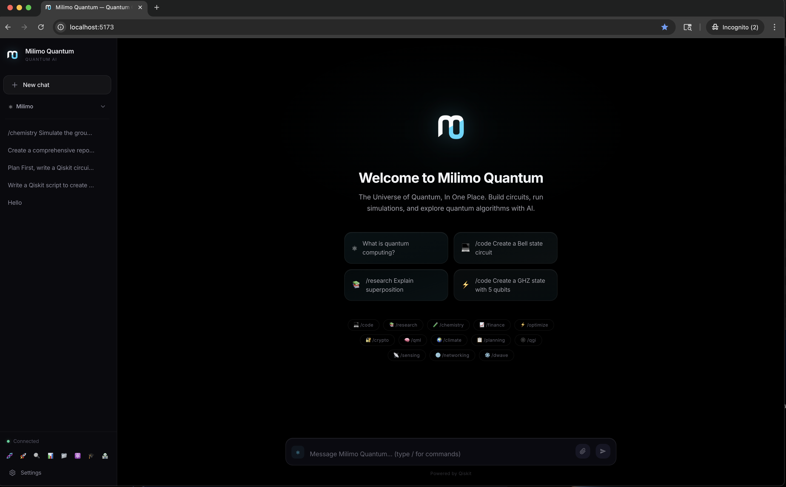
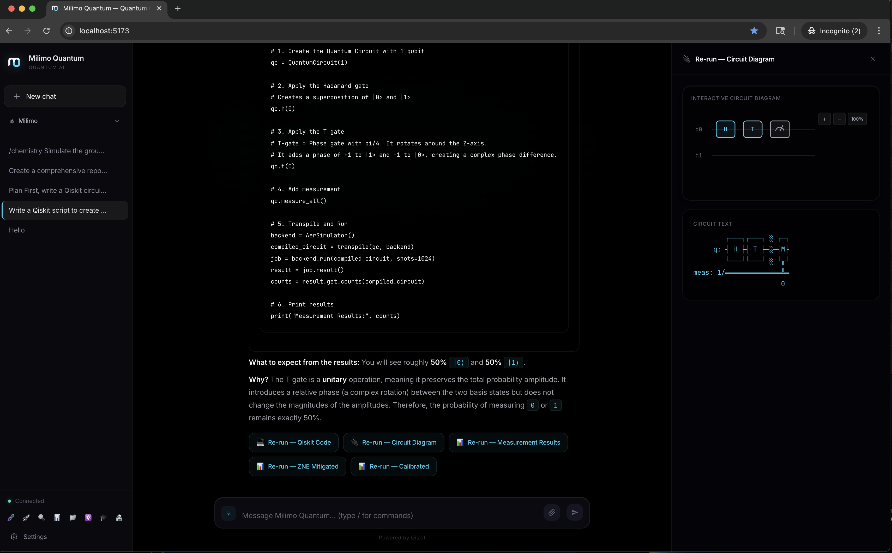
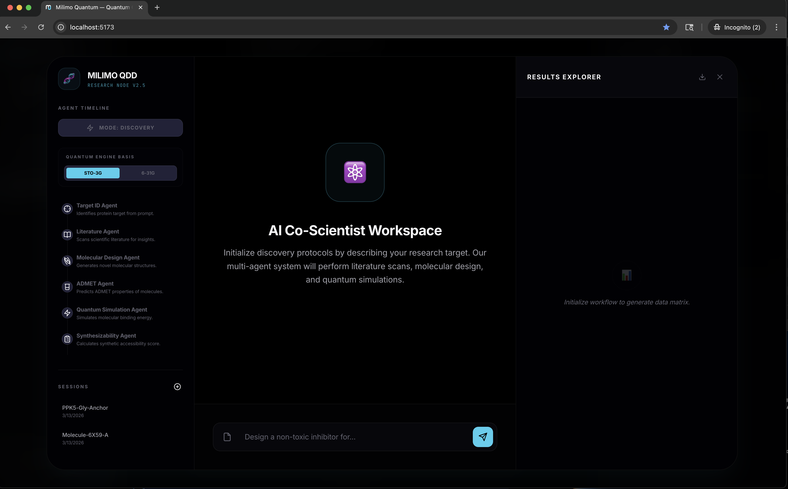
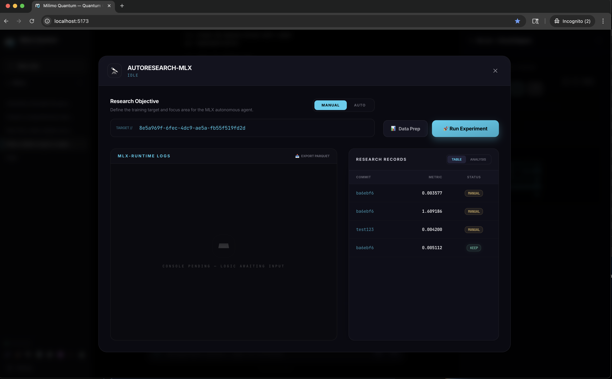

<div align="center">


# Milimo Quantum ⚛️

### The Ultimate Quantum-AI Research OS

**Author:** [Mainza Kangombe](https://www.linkedin.com/in/mainza-kangombe-6214295/)

[](https://opensource.org/licenses/MIT)
[](https://qiskit.org/)
[](https://reactjs.org/)
[](https://fastapi.tiangolo.com/)
[](.)

*Harness the power of quantum computing through an autonomous, hybrid AI-orchestrated research platform.*
</div>


> [!IMPORTANT]
> Milimo Quantum is **production-ready** for local simulation. Cloud quantum backends require API credentials.

---


## 🌌 Vision

**Milimo Quantum** is a **Hybrid Research OS** that bridges natural language intent with quantum computing execution. By uniting **Qiskit 2.x** with a sophisticated multi-agent network, it enables autonomous scientific discovery across IBM Quantum, D-Wave, and Amazon Braket, powered by local-first inference on Apple Silicon.

## ✨ Key Features

- 🧠 **17 Specialized Agents**: Orchestrator, Code, Research, Chemistry, Finance, Optimization, Crypto, QML, Climate, Planning, QGI, Sensing, Networking, D-Wave, Benchmarking, Fault Tolerance, Autoresearch Analyzer
- 🧬 **MQDD (Drug Discovery)**: VQE-based molecular simulation with ADMET predictions and molecular docking
- 🔬 **Autoresearch-MLX**: Self-improving research loops with MLX training and NemoClaw sandboxing
- ⚡ **Quantum Execution Engine**: Qiskit 2.x Aer simulation, IBM Quantum, D-Wave, Amazon Braket, Azure Quantum
- 🕸️ **Knowledge Graphs**: Neo4j, FalkorDB, and Kuzu for agent memory and concept relationships
- 🛡️ **Secure Sandbox**: NemoClaw OS-level sandboxing with network whitelist and filesystem isolation
- 📊 **168 Tests**: Comprehensive test coverage for quantum, extensions, and API routes

## 📸 Interface Preview

<div align="center">
<table style="width: 100%; border-collapse: collapse;">
<tr>
<td style="padding: 10px; width: 50%;">

</td>
<td style="padding: 10px; width: 50%;">

</td>
</tr>
<tr>
<td style="padding: 10px; width: 50%;">

</td>
<td style="padding: 10px; width: 50%;">

</td>
</tr>
</table>
</div>

---

## 🧱 Architecture & Project Structure

| System Layer | Description | Path |
| --- | --- | --- |
| **Frontend** | React 19 dashboard with VQE panel, circuit visualizer, extension panels | `/frontend` |
| **Backend** | FastAPI 0.115+ with 24 route modules, Celery/Redis async tasks | `/backend` |
| **Quantum** | 25 quantum modules (executor, VQE, QAOA, QAOA, HAL, sandbox) | `/backend/app/quantum` |
| **Agents** | 20 specialized agent implementations | `/backend/app/agents` |
| **Extensions** | MQDD (drug discovery), Autoresearch (ML training) | `/backend/app/extensions` |
| **Research Engine** | MLX training, VQE optimization, NemoClaw sandbox | `/autoresearch-mlx` |
| **Infrastructure** | PostgreSQL, Neo4j, Redis, Keycloak | `docker-compose.yml` |

---

## 🛠️ Technology Stack

| Category | Technologies |
|----------|-------------|
| **AI/ML** | MLX-LM (Apple Silicon), Ollama, OpenAI, Anthropic, Google GenAI, OpenRouter, NVIDIA NIM |
| **Quantum** | Qiskit 2.x, Qiskit-Aer, Qiskit-Algorithms, Qiskit-Nature, D-Wave Ocean, Amazon Braket, Azure Quantum |
| **Frontend** | React 19.2, Vite 7, Tailwind CSS 4, Monaco Editor, D3.js, XYFlow |
| **Backend** | Python 3.12+, FastAPI 0.115, Celery 5.4, Redis |
| **Databases** | PostgreSQL, Neo4j, FalkorDB, Kuzu, ChromaDB |
| **Auth** | Keycloak 24 (OAuth2), NemoClaw Sandbox |
| **Chemistry** | RDKit, PySCF, ADMET-AI |

---

## 🚀 Getting Started

### Prerequisites

- **Python 3.12+** (3.14 recommended for Apple Silicon)
- **Node.js 18+**
- **Docker & Docker Compose**
- **Apple Silicon Mac** (for MLX-native features)

### Quick Start

#### 1. Clone and Setup
```bash
git clone https://github.com/mainza-ai/milimoquantum.git
cd milimoquantum
```

#### 2. Configure Environment
```bash
# Copy example environment file
cp .env.example .env
# Edit .env with your settings (API keys, database passwords, etc.)
```

##### Cloud AI Providers
Milimo Quantum supports multiple cloud LLM providers. Set any of these in your `.env`:
```bash
# OpenAI
OPENAI_API_KEY=sk-...

# Anthropic Claude
ANTHROPIC_API_KEY=sk-ant-...

# Google Gemini
GOOGLE_API_KEY=AIza...

# OpenRouter (access to 350+ models)
OPENROUTER_API_KEY=sk-or-...

# NVIDIA NIM (188+ optimized models)
NVIDIA_API_KEY=nvapi-...
```
You can also configure providers and select models dynamically from the Settings UI (Settings → Cloud AI tab).

#### 3. Start Infrastructure (Docker)
```bash
./start-docker-mlx.sh
```
This starts PostgreSQL, Redis, Neo4j, Keycloak, and the frontend.

#### 4. Start Backend (Native for MLX)
```bash
./start-backend-mlx.sh
```

#### 5. Initialize Keycloak (First Run)
```bash
./setup-keycloak.sh
```
Access at `http://localhost:8081` with `admin/admin`.

#### 6. Access the Application
- **Frontend**: http://localhost:5173
- **API Docs**: http://localhost:8000/docs
- **Keycloak**: http://localhost:8081

#### 7. Shut Down
```bash
./stop-backend-mlx.sh && ./stop-docker.sh
```

---

## 🧪 VQE (Variational Quantum Eigensolver)

Full VQE implementation with Qiskit 2.x Aer simulation:

### Features
- **Real Quantum Simulation**: Qiskit Aer statevector/MPS backends
- **Molecular Hamiltonians**: H2, LiH, BeH2, custom molecules
- **Multiple Ansätze**: RealAmplitudes, EfficientSU2, TwoLocal, hardware-efficient
- **Optimizers**: SPSA, COBYLA, L-BFGS-B, SLSQP, Nelder-Mead
- **Meyer-Wallach Entanglement**: Circuit expressivity metric
- **Async Execution**: Celery task queue for long-running jobs

### API Endpoints
```bash
# Run VQE for H2 molecule
curl -X POST http://localhost:8000/api/autoresearch/vqe \
  -H "Content-Type: application/json" \
  -d '{"hamiltonian": "h2", "ansatz_type": "real_amplitudes", "optimizer_maxiter": 100}'

# Async VQE via Celery
curl -X POST http://localhost:8000/api/autoresearch/vqe/async \
  -H "Content-Type: application/json" \
  -d '{"hamiltonian": "lih", "optimizer": "cobyla"}'

# Check task status
curl http://localhost:8000/api/workflows/task/{task_id}
```

---

## 🔬 Quantum Modules (25 modules)

| Module | Description |
|--------|-------------|
| `executor.py` | Main quantum circuit execution engine |
| `vqe_executor.py` | VQE-specific execution with convergence tracking |
| `qaoa_executor.py` | QAOA optimization for combinatorial problems |
| `hal.py` | Hardware Abstraction Layer for platform detection |
| `sandbox.py` | Secure Python code execution with AST validation |
| `benchmarking.py` | CLOPS and Quantum Volume benchmarks |
| `ibm_runtime.py` | IBM Quantum backend integration |
| `dwave_provider.py` | D-Wave annealing integration |
| `braket_provider.py` | Amazon Braket integration |
| `azure_provider.py` | Azure Quantum integration |
| `cudaq_provider.py` | CUDA-Q (Linux x86_64 only) |
| `qrng.py` | Quantum Random Number Generator |

---

## 🤖 Agent Network (17 agents)

| Agent | Domain | Capabilities |
|-------|--------|--------------|
| `orchestrator` | General | Primary routing, intent classification |
| `code` | Quantum Code | Qiskit/Cirq/PennyLane generation |
| `research` | Education | arXiv search, paper summarization |
| `chemistry` | Molecular | VQE, molecular simulation (MQDD) |
| `finance` | Optimization | Portfolio optimization, Monte Carlo |
| `optimization` | Combinatorial | QAOA, Max-Cut, TSP |
| `crypto` | Security | QKD, QRNG, post-quantum crypto |
| `qml` | Machine Learning | QNN, QSVM, quantum kernels |
| `climate` | Materials | Battery research, carbon capture |
| `planning` | Workflows | Multi-step decomposition |
| `qgi` | Graph Intelligence | Memory retrieval, concept linking |
| `sensing` | Metrology | NV-centers, quantum sensors |
| `networking` | Communication | Quantum internet, teleportation |
| `dwave` | Annealing | QUBO, Ising models |
| `benchmarking` | Performance | Quantum Volume, CLOPS |
| `fault_tolerance` | Error Correction | Surface codes, QEC |
| `autoresearch_analyzer` | ML Training | Results analysis, optimization suggestions |

---

## 🔐 NemoClaw Sandbox

OS-level sandboxing for autonomous code execution:

### Installation
```bash
# Official NVIDIA installation
curl -fsSL https://nvidia.com/nemoclaw.sh | bash

# Setup (prompts for NVIDIA API key)
nemoclaw setup
```

### Features
- Network whitelist (HuggingFace, arXiv, PubMed, local services)
- Filesystem isolation (read-only system, blocked secrets)
- Resource limits (CPU, memory, process count)
- Audit logging for security events

### Usage
```bash
# List sandboxes
nemoclaw list

# Run experiment
cd autoresearch-mlx/nemoclaw/orchestrator
python runner.py run --experiment test
```

> **Note:** Without NemoClaw, the system uses simulation mode (direct subprocess execution).

---

## 📊 Test Coverage

```bash
# Run all tests
cd backend
pytest tests/ -v

# Run specific test categories
pytest tests/test_quantum_stack.py -v      # Quantum execution
pytest tests/test_autoresearch_extension.py -v  # Autoresearch
pytest tests/test_mqdd_extension.py -v     # Drug discovery
pytest tests/test_workflows.py -v          # Async workflows
```

**Total: 168 tests across 16 test files**

---

## 📚 Documentation

| Document | Description |
|----------|-------------|
| [ARCHITECTURE_DATA_FLOW.md](docs/ARCHITECTURE_DATA_FLOW.md) | System architecture with 16 Mermaid diagrams |
| [DATA_MODEL_STRUCTURE.md](docs/DATA_MODEL_STRUCTURE.md) | Complete data model reference |
| [AUDIT_REPORT.md](docs/AUDIT_REPORT.md) | Code quality audit and fixes |
| [MILIMO_QUANTUM_SYSTEM.md](docs/MILIMO_QUANTUM_SYSTEM.md) | Comprehensive system overview |

---

## 📜 License

Governed under the **MIT License**.

<div align="center">
<i>Bringing the quantum future to the minds of today.</i>
</div>
