# Milimo Quantum — Unified Architecture

```mermaid
graph TD
    subgraph Frontend ["Frontend Workspace - React/Vite"]
        UI_Shell["Main App Shell"]
        Sidebar["Sidebar Navigation"]
        
        subgraph FE_Ext ["Frontend Extension System"]
            FE_Registry["Extension Registry"]
            WorkspaceMgr["Workspace Manager"]
            CorePanels["Core Panels"]
            MQDD_UI["MQDD Panel"]
            AutoRes_UI["Autoresearch Panel - Planned"]
        end
        
        UI_Shell --> Sidebar
        UI_Shell --> WorkspaceMgr
        WorkspaceMgr --> FE_Registry
        FE_Registry --> CorePanels
        FE_Registry --> MQDD_UI
        FE_Registry --> AutoRes_UI
    end

    subgraph Backend ["Backend API - FastAPI"]
        MainRouter["Main FastAPI App"]
        Orchestrator["Agent Orchestrator"]
        ChatRouter["Chat Routes"]
        
        subgraph BE_Ext ["Backend Extension Registry"]
            BE_Registry["Global Registry"]
            
            subgraph MQDD ["MQDD Extension"]
                MQDD_Router["MQDD Router"]
                MQDD_Workflow["Workflow Orchestrator"]
                MQDD_Agents["Specialized Agents"]
            end
            
            subgraph AutoRes ["Autoresearch-MLX - Planned"]
                AutoRes_Router["AutoRes Router"]
                AutoRes_Workflow["Research Loop"]
            end
        end
        
        MainRouter --> ChatRouter
        MainRouter --> Orchestrator
        Orchestrator --> BE_Registry
        
        BE_Registry --> MQDD_Router
        MQDD_Router --> MQDD_Workflow
        MQDD_Workflow --> MQDD_Agents
        
        BE_Registry -.-> AutoRes_Router
        AutoRes_Router -.-> AutoRes_Workflow
    end
    
    subgraph Compute ["Local LLM Engine"]
        MLX["MLX Client - Apple Silicon"]
        Ollama["Ollama Client - Fallback"]
    end

    subgraph Storage ["Databases"]
        Postgres[("PostgreSQL")]
        Redis[("Redis")]
        Neo4j[("Neo4j Graph")]
    end

    ChatRouter --> MLX
    ChatRouter --> Ollama
    MQDD_Agents --> MLX
    MQDD_Agents --> Ollama
    AutoRes_Workflow -.-> MLX

    MainRouter --> Postgres
    MainRouter --> Redis
    Orchestrator --> Neo4j
    MQDD_Workflow --> Neo4j

    MQDD_UI --> MQDD_Router
    AutoRes_UI -.-> AutoRes_Router
    UI_Shell --> ChatRouter

    classDef planned fill:#1e1e2e,stroke:#3ecfef,stroke-width:2px,stroke-dasharray:5 5
    class AutoRes_UI planned
    class AutoRes planned
    class AutoRes_Router planned
    class AutoRes_Workflow planned
```

### Potential Missing Integration Points

| Layer | Issue | Impact |
|-------|-------|--------|
| **Vite Proxy** | Only `/api` is proxied — this works since MQDD router uses `/api/mqdd` prefix | ✅ Confirmed working |
| **CSRF** | Backend requires `X-Requested-With` header | ✅ Fixed in DrugDiscoveryPanel |
| **LLM Backend** | [agents.py](file:///Users/mck/Desktop/milimoquantum/backend/app/extensions/mqdd/agents.py) hardcodes `ollama_client` — if Ollama is not running, all agents fail silently | ⚠️ Should fallback to MLX |
| **Frontend Docker** | Docker frontend uses `host.docker.internal:8000` but Neo4j/Keycloak containers may not be running | ⚠️ Check Docker logs |
| **Autoresearch-MLX** | Not yet wired into the Extension Registry | 🔮 Planned |
