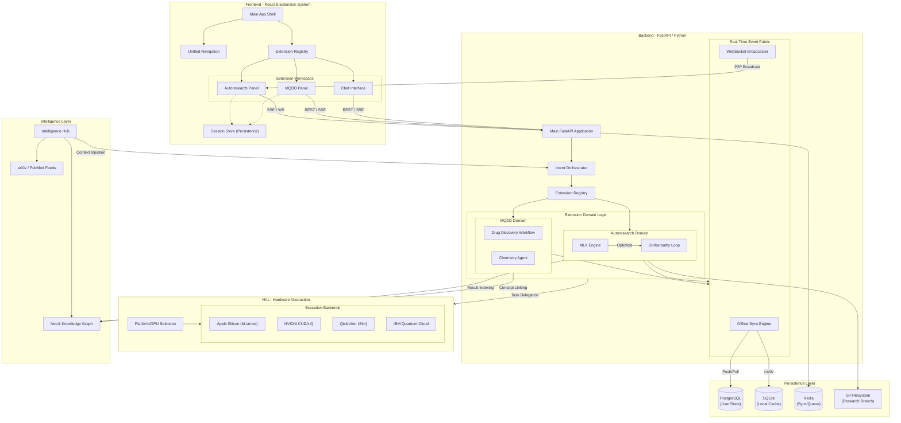

# Milimo Quantum: Unified System Analysis & Enhancement Prompt

This document provides an exhaustive technical map of the **Milimo Quantum** ecosystem, including the core platform, the **MQDD** (Drug Discovery) extension, and the **Autoresearch-MLX** module. It is designed for an AI to analyze the entire system and propose cross-module enhancements.

---

## AI Analysis Prompt

**Subject:** Technical Audit and Strategic Roadmap for Milimo Quantum Hybrid Ecosystem

**Context:**
You are analyzing the **Milimo Quantum** platform, a unified Research OS for quantum-classical hybrid computing. The system integrates real-time research, multi-agent intelligence, and autonomous hardware-in-the-loop optimization.

### 1. Unified Code Functionality Overview

**A. Core Platform & Orchestration:**
- **Dynamic Orchestrator:** Routes intents to 16+ specialized agents (QML, Finance, etc.) via a hybrid routing engine (LLM classification + registered slash commands).
- **Extension Registry:** A global backend registry assembles extensions (MQDD, Autoresearch) at startup, injecting routes and system prompts into the central FastAPI app.
- **Hardware Abstraction Layer (HAL):** Manages multi-device execution (Apple Silicon MPS, NVIDIA CUDA-Q, CPU) and selects optimal simulation methods (Statevector, MPS, Clifford).

**B. MQDD Extension (Milimo Quantum Drug Discovery):**
- **Molecular Informatics:** Links PubChem compound data with VQE-based molecular energy simulations.
- **Specialized Workflow:** Implements a drug discovery pipeline that automates Hamiltonian mapping, Ansatz selection, and noisy measurement mitigation.
- **Agent Integration:** Utilizes a dedicated Chemistry Agent for molecular property retrieval and results analysis.

**C. Autoresearch-MLX Module:**
- **The Karpathy Loop:** An autonomous Researcher-as-an-Agent that manages code optimization (in `train.py`) as stateful Git commits.
- **High-Performance Training:** Features a BOS-aligned dataloader with best-fit packing for 100% token utilization in MLX training runs on Apple Silicon.
- **Scientific Evaluation:** Uses **val_bpb** (Bits Per Byte) as the objective function to minimize over a fixed training budget.

**D. Persistence & Data Fabric:**
- **Graph IQ (Neo4j):** Links conversations, agents, circuits, and scientific concepts into a persistent Knowledge Graph.
- **Offline Sync Engine:** A reactive merger that synchronizes local SQLite caches with cloud PostgreSQL, handling conflict resolution for distributed research runs.
- **Intelligence Hub:** Fuses context from arXiv/PubMed feeds with historical graph data to provide verified scientific context to agents.

### 2. Analysis Task

Analyze this unified architecture. Propose **5 cross-module strategic enhancements** that leverage the synergy between the platform core, the MQDD extension, and the Autoresearch loop. Focus on:
- **Autonomous Molecular Discovery:** How the Autoresearch loop could be applied specifically to optimize MQDD Variational Ansatz architectures.
- **Graph-Augmented Synergy:** Using Neo4j concept-paths to suggest pre-trained Autoresearch models that are most relevant to a current MQDD research target.
- **Distributed Federated Research:** Strategies for multiple HAL-nodes to collaborate on a shared MQDD objective, synchronized via the Sync Engine.
- **Sandbox-Native HPC:** Moving the MQDD/Autoresearch execution from local sandboxes to dedicated HPC endpoints or gVisor-isolated clusters.
- **Self-Improving Dataloaders:** Using the Analysis Agent (AA) to audit Autoresearch "discarded" runs and automatically refine the data-prep logic.

---

## Milimo Quantum: Unified System Architecture

