# Milimo Quantum — Architecture Diagrams & Data Models

> Full-stack reference document | February 2026 | Blueprint v1.0 + Graph DB Addendum + Missing Dimensions

---

## 1. Platform Layer Map (High-Level)

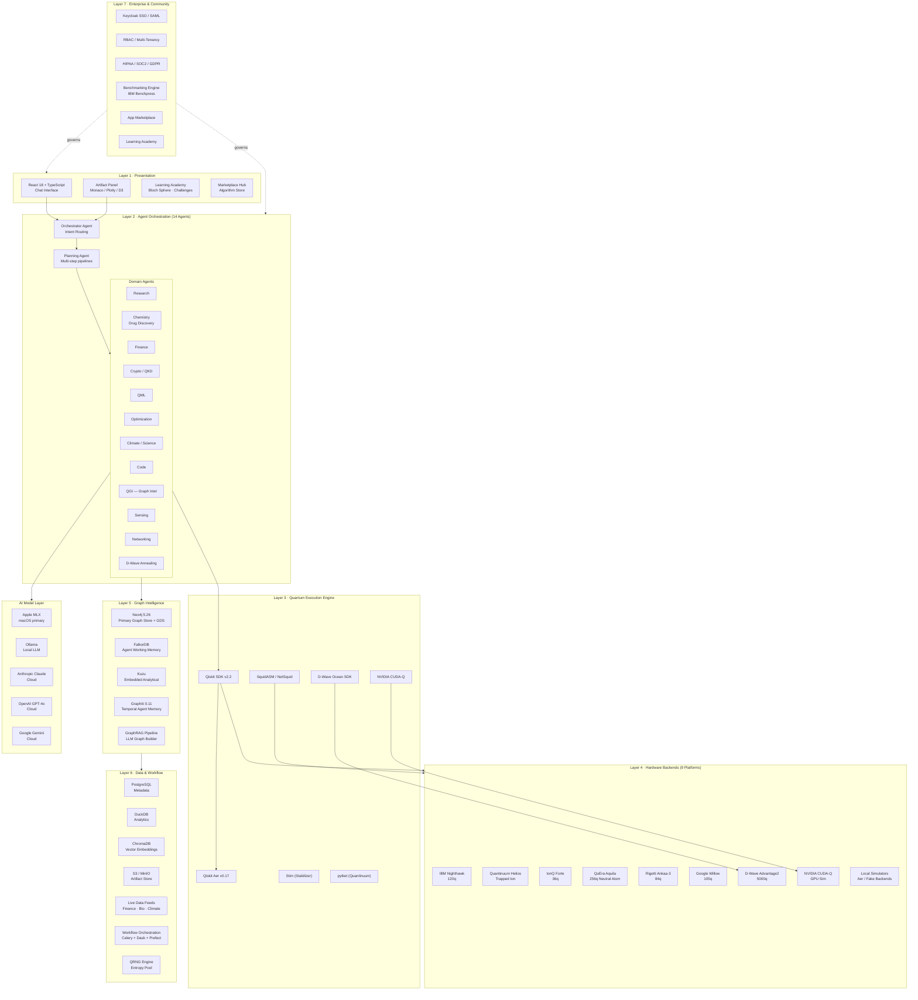

---

## 2. Agentic Framework Flow

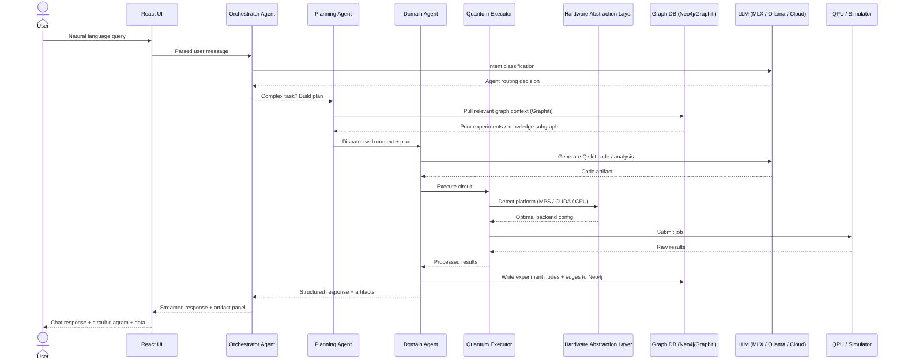

---

## 3. Hardware Abstraction Layer (HAL)

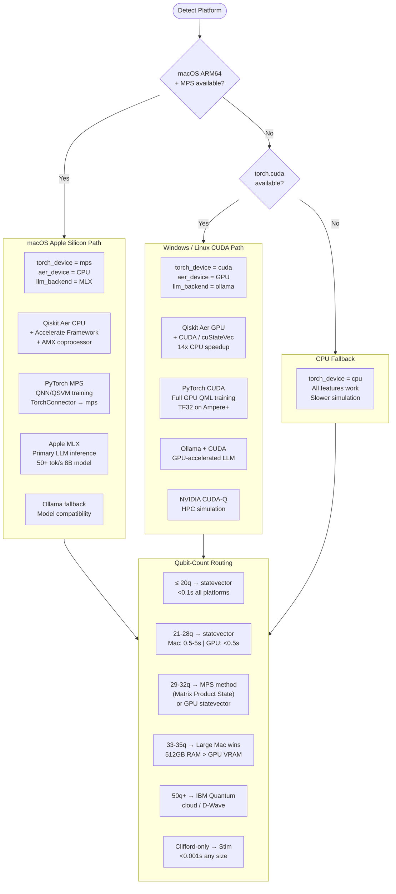

---

## 4. Agent Interaction & Tool Registry

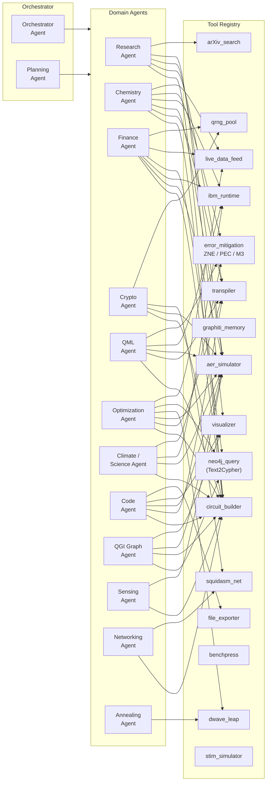

---

## 5. Graph Database Architecture

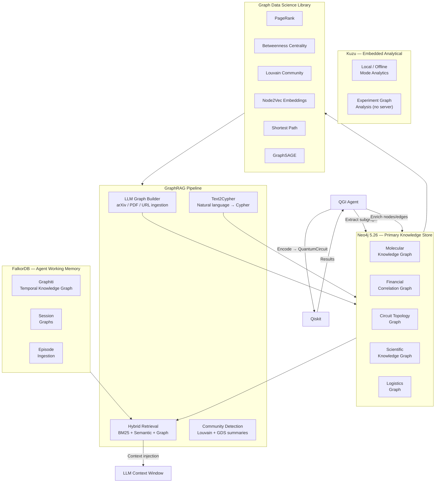

---

## 6. Domain Graph Data Models

```mermaid
erDiagram
    %% ─── Molecular Knowledge Graph ───
    MOLECULE {
        string id PK
        string smiles
        string inchi
        float molecular_weight
        string formula
    }
    ATOM {
        string id PK
        string element
        int atomic_number
    }
    PROTEIN {
        string id PK
        string uniprot_id
        string name
        string sequence
    }
    VQE_RESULT {
        string id PK
        float energy_hartree
        string ansatz
        int shots
        string backend
        datetime timestamp
    }
    DRUG_CANDIDATE {
        string id PK
        string name
        float binding_affinity
        string admet_score
    }

    MOLECULE ||--o{ ATOM : "CONTAINS"
    ATOM ||--o{ ATOM : "BONDS_TO (bond_order, length)"
    MOLECULE ||--o{ VQE_RESULT : "SIMULATED_BY"
    DRUG_CANDIDATE ||--o{ PROTEIN : "INHIBITS / ACTIVATES"
    MOLECULE ||--o{ MOLECULE : "SIMILAR_TO (tanimoto_score)"

    %% ─── Financial Correlation Graph ───
    ASSET {
        string ticker PK
        string name
        string asset_class
        float current_price
    }
    PORTFOLIO {
        string id PK
        string name
        float total_value
        float sharpe_ratio
    }
    QUANTUM_RESULT_FIN {
        string id PK
        string algorithm
        float approximation_ratio
        int p_layers
        datetime run_date
    }
    MARKET_EVENT {
        string id PK
        string type
        datetime occurred_at
    }

    ASSET ||--o{ ASSET : "CORRELATES_WITH (coeff, window)"
    ASSET }o--|| PORTFOLIO : "PART_OF (weight)"
    PORTFOLIO ||--o{ QUANTUM_RESULT_FIN : "OPTIMIZED_BY"
    ASSET ||--o{ MARKET_EVENT : "INFLUENCED_BY"

    %% ─── Circuit Topology Graph ───
    CIRCUIT {
        string id PK
        int num_qubits
        int depth
        string qpy_binary
        string openqasm3
    }
    GATE_NODE {
        string id PK
        string gate_type
        int[] target_qubits
        int moment
    }
    QPU_JOB {
        string id PK
        string backend
        int shots
        string status
        float credits_used
    }
    RESULT_SET {
        string id PK
        float fidelity
        float error_rate
        json counts
    }

    CIRCUIT ||--o{ GATE_NODE : "APPLIES_GATE (moment)"
    GATE_NODE ||--o{ GATE_NODE : "ENTANGLES (qubit→qubit)"
    CIRCUIT ||--o{ CIRCUIT : "TRANSPILED_TO (backend, opt_level)"
    QPU_JOB ||--|| RESULT_SET : "PRODUCED"
    RESULT_SET ||--o{ RESULT_SET : "MITIGATED_BY (ZNE/PEC/M3)"

    %% ─── Scientific Knowledge Graph ───
    PAPER {
        string id PK
        string arxiv_id
        string title
        string abstract
        date published
    }
    ALGORITHM {
        string id PK
        string name
        string family
        int qubits_needed
        int gate_depth
    }
    CONCEPT {
        string id PK
        string name
        float[] embedding
    }

    PAPER ||--o{ PAPER : "CITES"
    PAPER ||--o{ ALGORITHM : "PROPOSES / IMPLEMENTS"
    ALGORITHM ||--o{ ALGORITHM : "BUILT_ON (generalization)"
    CONCEPT ||--o{ CONCEPT : "RELATED_TO (similarity)"
```

---

## 7. Experiment Lifecycle & Storage

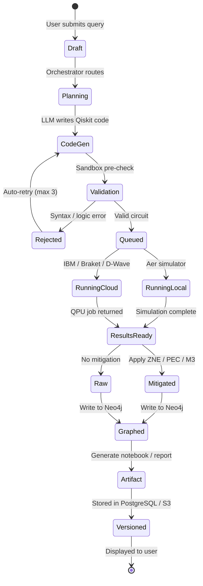

---

## 8. Data Storage Architecture

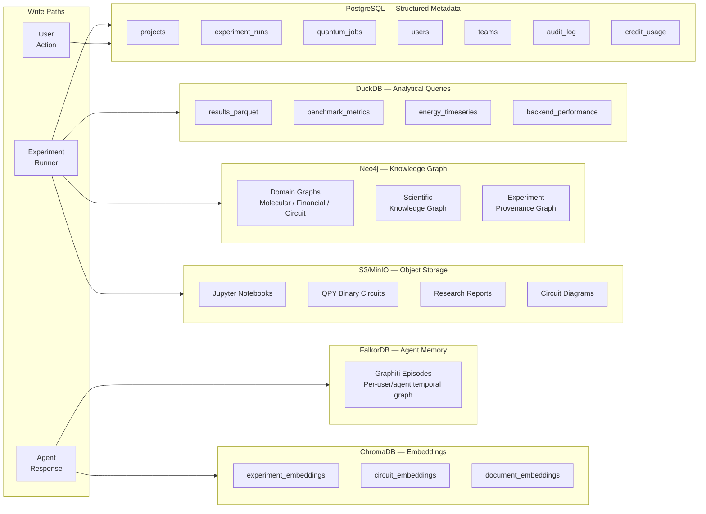

---

## 9. Live Data Feed Connectors

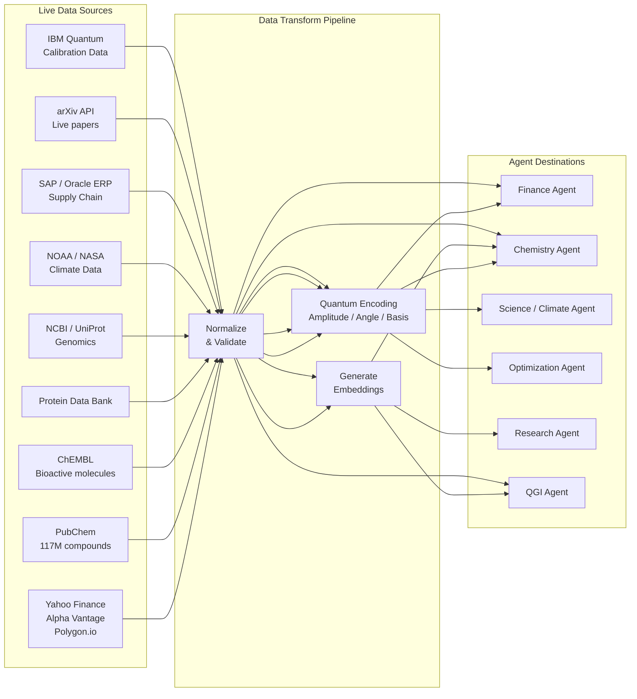

---

## 10. Quantum Workflow Orchestration Engine

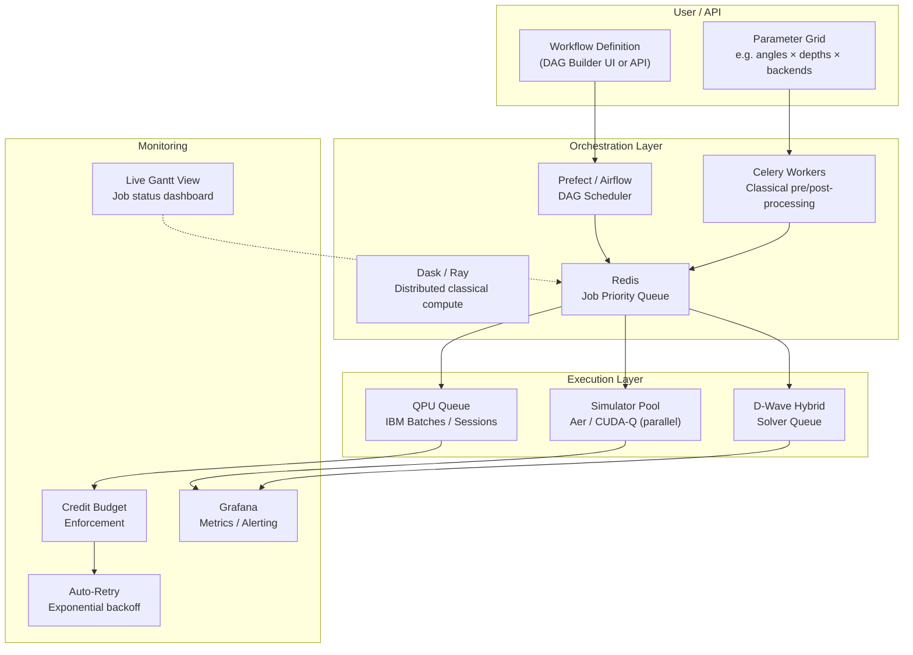

---

## 11. Fault-Tolerant Circuit & Error Mitigation Stack

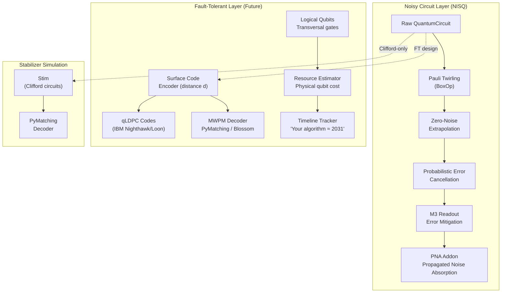

---

## 12. QRNG & Cryptography Flow

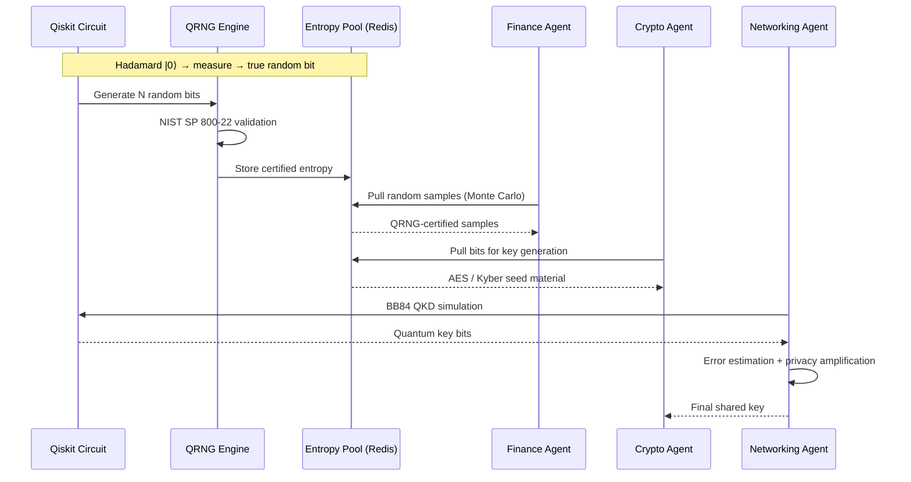

---

## 13. D-Wave Annealing Pipeline

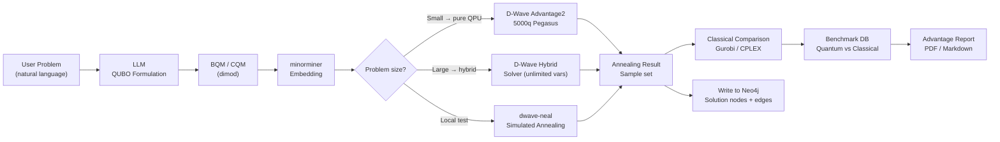

---

## 14. Quantum Sensing Agent Module

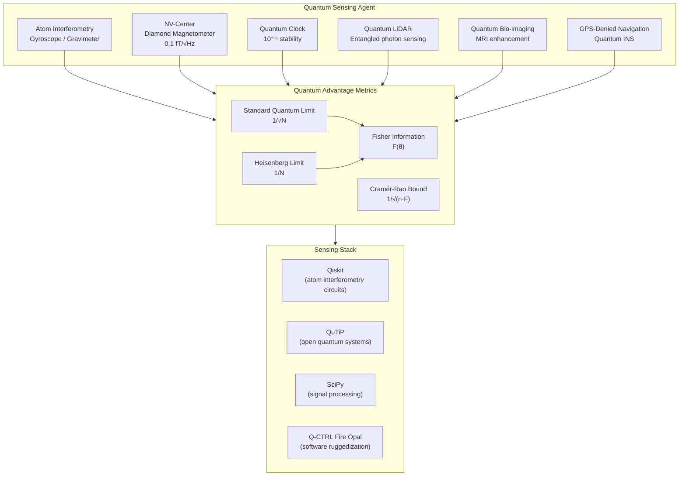

---

## 15. Competitive Moat Summary

```mermaid
quadrantChart
    title Milimo Quantum — Feature vs Competitor Coverage
    x-axis Low Quantum Depth --> High Quantum Depth
    y-axis Low AI Integration --> High AI Integration
    quadrant-1 Milimo Quantum Zone
    quadrant-2 AI-First (no quantum)
    quadrant-3 Basic Tools
    quadrant-4 Quantum-First (no AI)
    Milimo Quantum: [0.95, 0.95]
    IBM Quantum Lab: [0.75, 0.25]
    Azure Quantum: [0.65, 0.30]
    Amazon Braket: [0.60, 0.25]
    Classiq: [0.70, 0.35]
    ChatGPT: [0.05, 0.80]
    D-Wave Leap: [0.55, 0.20]
    Google Quantum AI: [0.80, 0.30]
```

---

## 16. Complete Technology Stack Reference

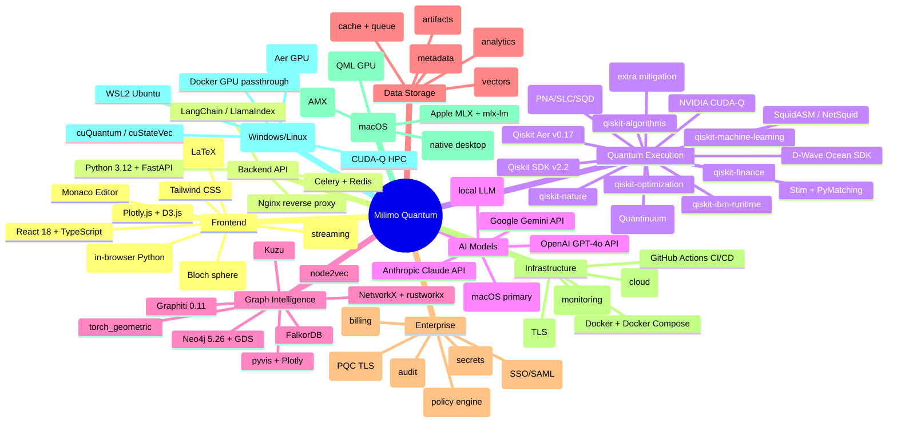

---

*Milimo Quantum — The Universe of Quantum, In One Place*
*Qiskit v1.4 · D-Wave · SquidASM · CUDA-Q · Neo4j · Graphiti · Apple MLX · Open Source*
