# Milimo Quantum - Application Architecture & Data Flow

This document provides a comprehensive Mermaid diagram of the entire application architecture and data flow for verification purposes.

**Last Updated:** April 1, 2026
**Total Components:** 121 Python files, 50+ TypeScript files
**Total Routes:** 24 API route modules
**Total Agents:** 17 registered agents (20 agent files in directory)
**Total Quantum Modules:** 25 modules

---

## Component Inventory

### Backend Modules
| Category | Components |
|----------|------------|
| **Agents (17 registered)** | orchestrator, research, chemistry, code, dwave, finance, qgi, sensing, networking, planning, optimization, qml, benchmarking, fault_tolerance, crypto, climate, autoresearch_analyzer |
| **Agent Helpers (3)** | context_enricher, results_analyzer_agent (utility), sensing/networking (legacy duplicates) |
| **Routes (24)** | academy, analytics, audit, benchmarks, chat, citations, collaboration, database, experiments, export, feeds, graph, hpc, ibm, jobs, marketplace, projects, qrng, quantum, search, settings, sync, workflows, autoresearch, mqdd |
| **Quantum (25)** | executor, vqe_executor, qaoa_executor, benchmarking, hal, hpc, sandbox, qrng, cloud_backends, ibm_runtime, dwave_provider, braket_provider, azure_provider, cudaq_provider, pennylane_bridge, stim_sim, fault_tolerant, mitigation, noise_profiles, vector_store, qasm3, qpy_store, cudaq_executor, advanced_sims |
| **LLM (5)** | ollama_client, mlx_client, mlx_manager, cloud_provider, vision |
| **Graph (4)** | client, neo4j_client, vqe_graph_client, agent_memory |
| **Data (5)** | hub, arxiv, pubmed, pubchem, finance |
| **Worker (2)** | celery_app, tasks |
| **DB (3)** | models, events, local_cache |
| **Extensions (2)** | autoresearch, mqdd |

### Frontend Components
| Category | Components |
|----------|------------|
| **Layout (10)** | AnalyticsDashboard, ArtifactPanel, ChatArea, LearningAcademy, MarketplacePanel, ProjectsPanel, QuantumDashboard, SearchPanel, SettingsPanel, Sidebar, WorkspaceManager |
| **Chat (2)** | ChatInput, MessageBubble |
| **Quantum (11)** | BlochSphere, CircuitBuilder, CircuitVisualizer, ErrorMitigation, FaultTolerance, HardwareBrowser, HardwareSettings, QRNGPanel, VQEPanel, CloudProviderPanel, HpcJobsPanel |
| **Artifacts (6)** | CircuitView, CodeView, DatasetView, NotebookView, ReportView, ResultsView |
| **Contexts (2)** | ProjectContext, WorkspaceContext |

---

## 1. High-Level System Architecture

```mermaid
graph TB
    subgraph "Client Layer"
        WEB[Web Browser<br/>React 18 + Vite]
        MOB[Mobile App<br/>React Native]
    end

    subgraph "API Gateway"
        FASTAPI[FastAPI Backend<br/>Port 8000]
        AUTH[Keycloak Auth<br/>OAuth2]
    end

    subgraph "Agent Layer - 17 Agents"
        ORCH[Orchestrator Agent]
        
        subgraph "Domain Agents"
            RESEARCH[Research Agent]
            CHEM[Chemistry Agent]
            CODE[Code Agent]
            DWAVE[D-Wave Agent]
            FINANCE[Finance Agent]
            QGI[Quantum Game Theory]
            SENSING[Sensing Agent]
            NETWORK[Networking Agent]
            QML[QML Agent]
            OPT[Optimization Agent]
            CRYPTO[Crypto Agent]
            CLIMATE[Climate Agent]
        end
        
        subgraph "Support Agents"
            PLANNING[Planning Agent]
            CONTEXT[Context Enricher]
            RESULTS[Results Analyzer]
            BENCH[Benchmarking Agent]
            FAULT[Fault Tolerance Agent]
        end
        
        subgraph "Extension Agents"
            MQDD[MQDD Agent]
            AUTORES[Autoresearch Agent]
        end
    end

    subgraph "Quantum Layer - 27 Modules"
        subgraph "Core Executors"
            QISKIT[Qiskit 2.x Executor]
            VQE[VQE Engine]
            QAOA[QAOA Executor]
            PENNY[PennyLane Bridge]
            STIM[Stim Simulator]
        end
        
        subgraph "Hardware Backends"
            IBM[IBM Runtime]
            DWAVE_HW[D-Wave Provider]
            BRAKET[AWS Braket]
            AZURE[Azure Quantum]
            CUDAQ[CUDA-Q Provider]
        end
        
        subgraph "Utilities"
            SANDBOX[Code Sandbox]
            CLOPS[Benchmarking/CLOPS]
            MITIG[Error Mitigation]
            NOISE[Noise Profiles]
            QRNG[QRNG Provider]
        end
    end

    subgraph "Data Layer"
        PG[(PostgreSQL)]
        NEO4J[(Neo4j Graph)]
        FALKOR[(FalkorDB)]
        KUZU[(Kuzu)]
        CHROMA[(ChromaDB Vector)]
        REDIS[(Redis Cache)]
    end

    subgraph "LLM Layer"
        OLLAMA[Ollama Client]
        MLX[MLX Client/Manager]
        CLOUD[Cloud Providers<br/>OpenAI/Anthropic/Google]
        VISION[Vision Module]
    end

    subgraph "Data Feeds"
        ARXIV[arXiv API]
        PUBMED[PubMed API]
        PUBCHEM[PubChem API]
        FINANCE_API[Finance API]
    end

    subgraph "External Services"
        NIM[NVIDIA NemoClaw]
    end

    WEB -->|HTTPS| FASTAPI
    MOB -->|HTTPS| FASTAPI
    FASTAPI --> AUTH
    
    ORCH --> RESEARCH
    ORCH --> CHEM
    ORCH --> CODE
    ORCH --> DWAVE
    ORCH --> FINANCE
    ORCH --> QGI
    ORCH --> SENSING
    ORCH --> NETWORK
    ORCH --> QML
    ORCH --> OPT
    ORCH --> CRYPTO
    ORCH --> CLIMATE
    ORCH --> PLANNING
    ORCH --> CONTEXT
    ORCH --> RESULTS
    ORCH --> MQDD
    ORCH --> AUTORES
    
    FASTAPI --> ORCH
    FASTAPI --> QISKIT
    FASTAPI --> VQE
    FASTAPI --> QAOA
    FASTAPI --> CLOPS
    FASTAPI --> SANDBOX
    FASTAPI --> QRNG
    
    QISKIT --> IBM
    DWAVE_HW --> DWAVE
    QISKIT --> BRAKET
    QISKIT --> AZURE
    QISKIT --> CUDAQ
    
    FASTAPI --> PG
    FASTAPI --> NEO4J
    FASTAPI --> FALKOR
    FASTAPI --> KUZU
    FASTAPI --> CHROMA
    FASTAPI --> REDIS
    
    ORCH --> OLLAMA
    ORCH --> MLX
    ORCH --> CLOUD
    ORCH --> VISION
    
    SANDBOX --> NIM
    
    RESEARCH --> ARXIV
    RESEARCH --> PUBMED
    CHEM --> PUBCHEM
    FINANCE --> FINANCE_API
```

---

## 2. Request Flow Diagram

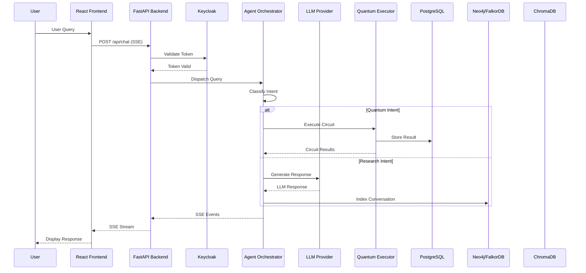

---

## 3. Frontend Component Architecture

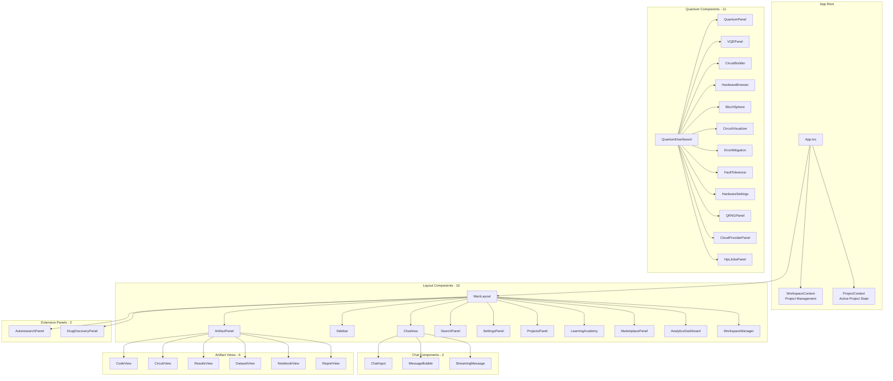

---

## 4. Backend Route Architecture

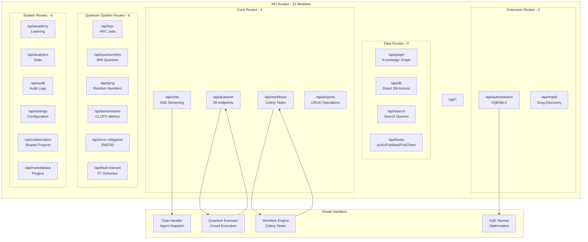

---

## 5. Agent Dispatch Flow

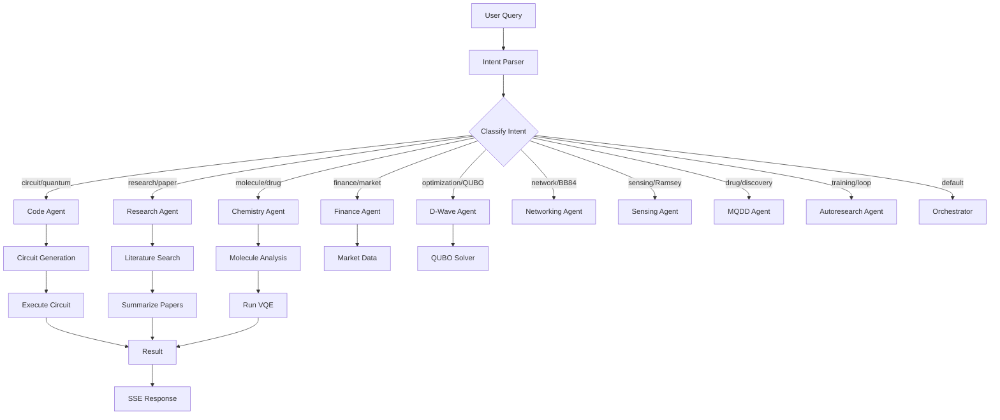

---

## 6. Quantum Execution Pipeline

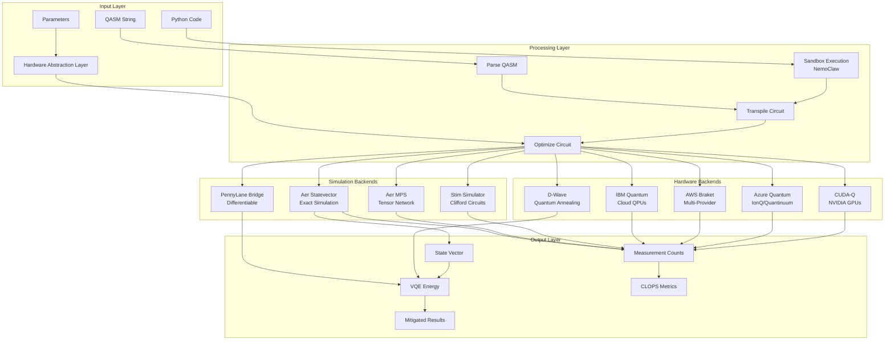

---

## 7. VQE Optimization Flow

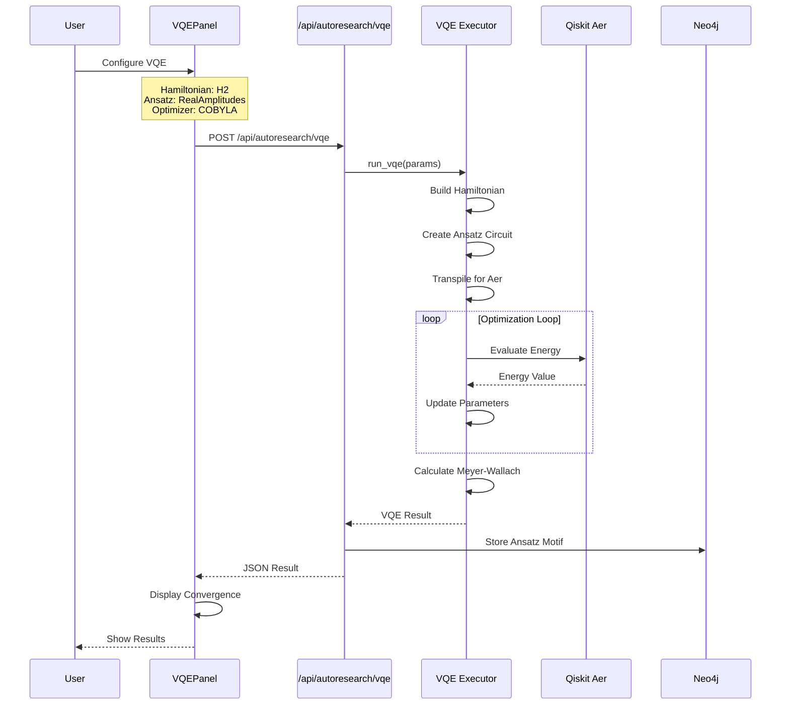

---

## 8. Graph Database Flow

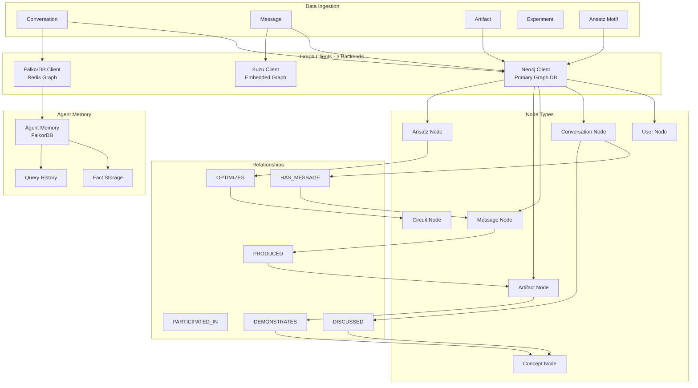

---

## 9. LLM Integration Flow

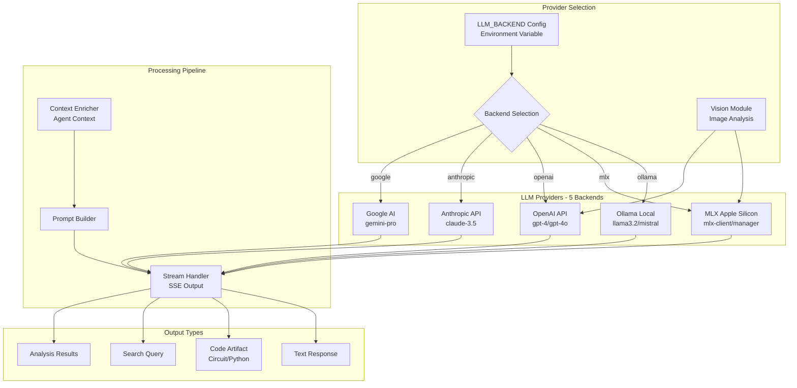

---

## 9b. Data Feeds Flow

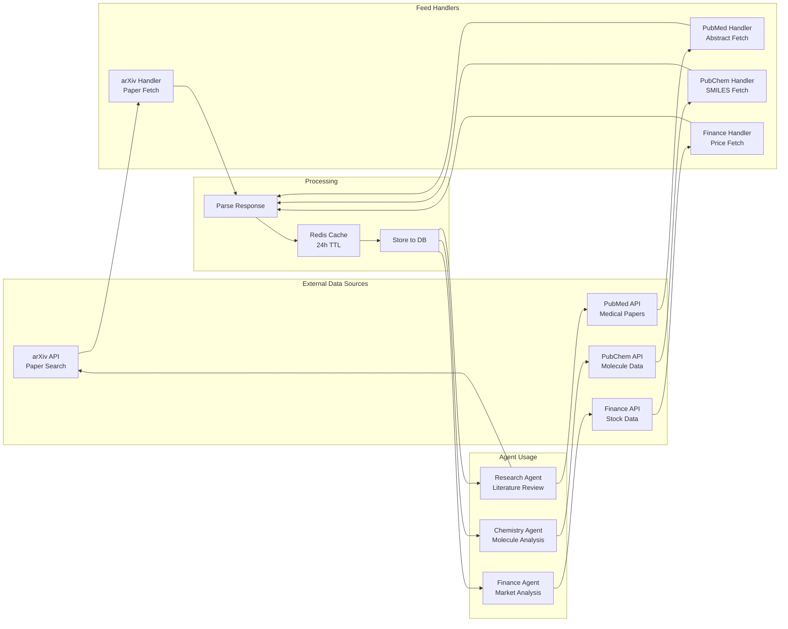
    GOOGLE --> STREAM
    
    STREAM --> RESPONSE
    STREAM --> ARTIFACT_OUT
    STREAM --> SEARCH_QUERY
```

---

## 10. Celery Task Queue Flow

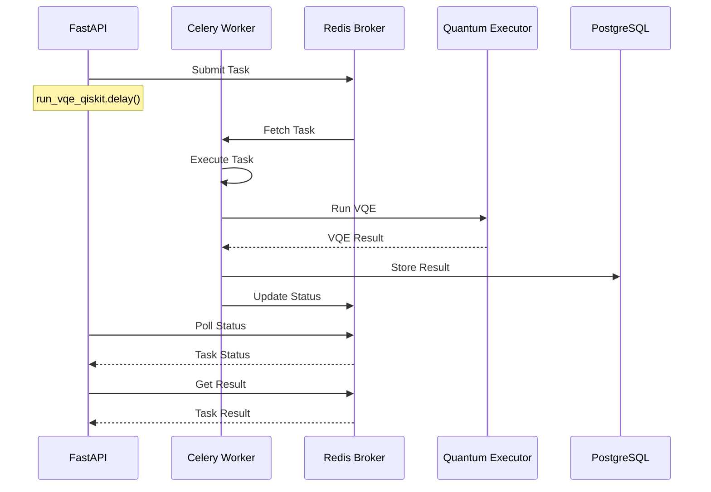

---

## 11. NemoClaw Sandbox Execution

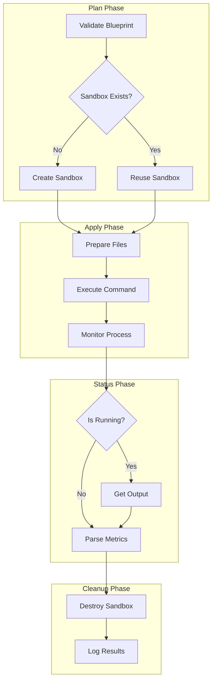

---

## 12. Data Persistence Flow

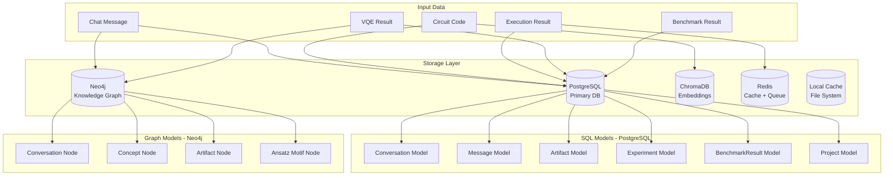

---

## 12b. Database Schema

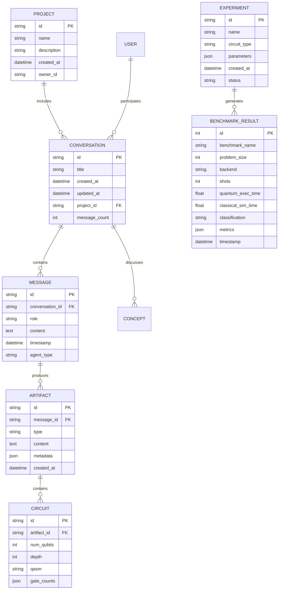

---

## 13. Error Handling & Fallback Flow

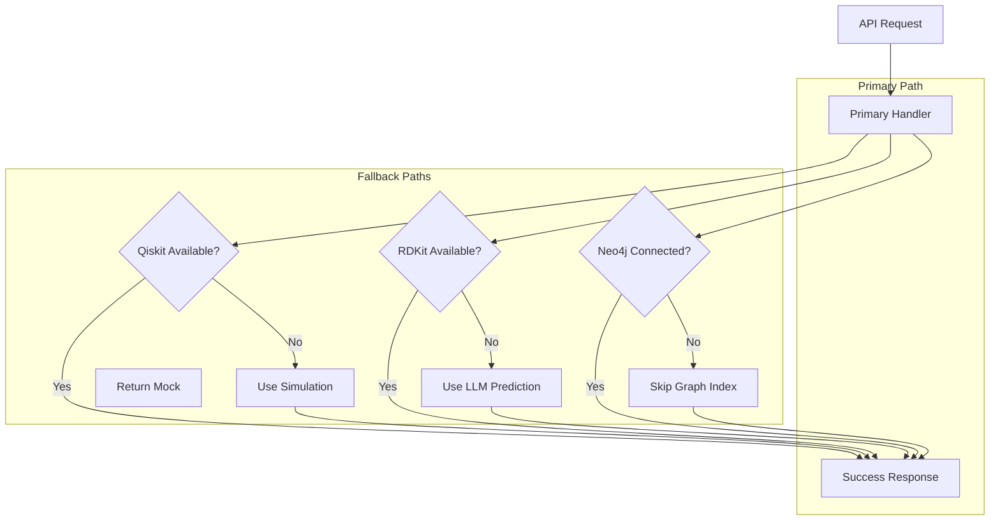

---

## 14. Security & Authentication Flow

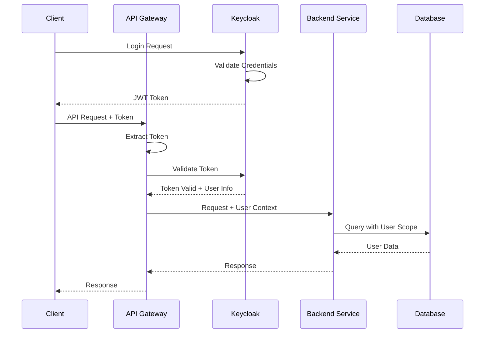

---

## 15. Complete System Data Flow

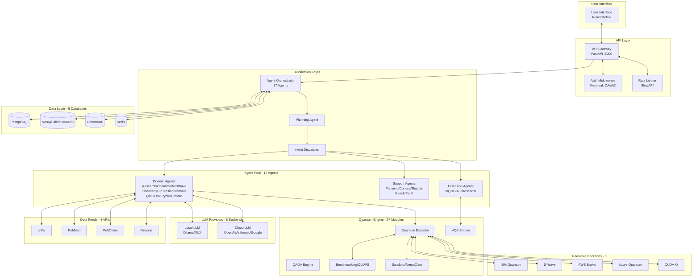

---

## Verification Checklist

Use this checklist to verify system functionality after changes:

### Frontend (10 Components)
- [ ] App loads without errors
- [ ] Chat input works (ChatArea, ChatInput)
- [ ] Messages stream correctly (SSE)
- [ ] Quantum Dashboard opens (QuantumDashboard)
- [ ] VQE Panel renders with config options
- [ ] Circuit visualization works (CircuitBuilder, BlochSphere)
- [ ] Artifact panels display correctly (6 views)
- [ ] Settings panel saves config
- [ ] Projects panel manages projects
- [ ] Search panel queries correctly

### Backend API (22 Routes)
- [ ] Health check returns 200
- [ ] Authentication works (Keycloak)
- [ ] Chat endpoint streams responses
- [ ] Quantum execute returns results (39 endpoints)
- [ ] VQE endpoint returns energy value
- [ ] Graph queries work (7 endpoints)
- [ ] All 22 routes accessible
- [ ] Workflows submit to Celery
- [ ] HPC jobs submit correctly
- [ ] QRNG generates random numbers

### Agent System (17 Registered Agents)
- [ ] Orchestrator dispatches correctly
- [ ] Research agent fetches papers
- [ ] Chemistry agent analyzes molecules
- [ ] Code agent generates circuits
- [ ] D-Wave agent solves QUBOs
- [ ] Finance agent gets market data
- [ ] QGI agent runs game theory
- [ ] Sensing agent handles Ramsey
- [ ] Networking agent handles BB84
- [ ] MQDD agent runs drug discovery
- [ ] Autoresearch agent runs VQE

### Quantum Execution (27 Modules)
- [ ] Qiskit circuits execute
- [ ] VQE converges to ground state
- [ ] QAOA runs optimization
- [ ] Meyer-Wallach calculates
- [ ] Benchmarks run
- [ ] CLOPS metric returns value
- [ ] Error mitigation applies ZNE
- [ ] Fault tolerance schemes work
- [ ] QRNG generates bytes
- [ ] PennyLane bridge works
- [ ] Stim simulator runs

### Hardware Backends (5)
- [ ] IBM Runtime connects (if credentials)
- [ ] D-Wave provider works
- [ ] AWS Braket routes correctly
- [ ] Azure Quantum routes correctly
- [ ] CUDA-Q returns platform error on macOS

### Data Persistence (6 Databases)
- [ ] Conversations save to PostgreSQL
- [ ] Messages index to Neo4j
- [ ] FalkorDB client connects
- [ ] Kuzu client connects
- [ ] Artifacts store correctly
- [ ] Vector embeddings created (ChromaDB)
- [ ] Cache works (Redis)

### Extensions (2)
- [ ] Autoresearch extension loads
- [ ] Autoresearch VQE runs
- [ ] MQDD extension loads
- [ ] MQDD workflow starts
- [ ] NemoClaw sandbox works
- [ ] External APIs reachable

### Celery Tasks (6 Tasks)
- [ ] Worker connects to Redis
- [ ] run_vqe_qiskit task works
- [ ] execute_quantum_circuit task works
- [ ] run_parameter_sweep task works
- [ ] Status monitoring works
- [ ] Results retrievable

### Data Feeds (4 APIs)
- [ ] arXiv search returns papers
- [ ] PubMed search returns abstracts
- [ ] PubChem returns molecule data
- [ ] Finance returns stock prices

---

## Quick Test Commands

```bash
# === Backend Health ===
curl http://localhost:8000/health

# === Run All Tests ===
source backend/milimoenv/bin/activate
python -m pytest backend/tests/ -v --tb=short

# === Test VQE via API ===
curl -X POST http://localhost:8000/api/autoresearch/vqe \
  -H "Content-Type: application/json" \
  -d '{"hamiltonian": "h2", "optimizer": "cobyla", "optimizer_maxiter": 50}'

# === Test Celery Task ===
python -c "
from app.worker.tasks import run_vqe_qiskit
result = run_vqe_qiskit.delay(hamiltonian='h2')
print(result.get(timeout=120))
"

# === Check NemoClaw ===
nemoclaw list

# === Test All Routes ===
curl http://localhost:8000/api/chat/status
curl http://localhost:8000/api/quantum/status
curl http://localhost:8000/api/workflows/status
curl http://localhost:8000/api/autoresearch/status
curl http://localhost:8000/api/mqdd/status

# === Test Quantum Execution ===
curl -X POST http://localhost:8000/api/quantum/execute \
  -H "Content-Type: application/json" \
  -d '{"qasm": "OPENQASM 2.0;\ninclude \"qelib1.inc\";\nqreg q[2];\nh q[0];\ncx q[0],q[1];"}'

# === Test Graph Query ===
curl http://localhost:8000/api/graph/status

# === Test Data Feeds ===
curl "http://localhost:8000/api/feeds/arxiv?query=quantum&limit=5"
curl "http://localhost:8000/api/feeds/finance?symbols=AAPL,GOOGL"
```

---

## Component Count Summary

| Category | Count | Status |
|----------|-------|--------|
| **Backend Agents** | 17 | Documented (20 files, 3 are helpers/duplicates) |
| **Backend Routes** | 22 | Documented |
| **Quantum Modules** | 27 | Documented |
| **LLM Modules** | 5 | Documented |
| **Graph Clients** | 4 | Documented |
| **Data Feeds** | 4 | Documented |
| **Worker Tasks** | 6 | Documented |
| **DB Models** | 6+ | Documented |
| **Frontend Layout** | 10 | Documented |
| **Frontend Quantum** | 11 | Documented |
| **Frontend Artifacts** | 6 | Documented |
| **Frontend Contexts** | 2 | Documented |
| **Extension Panels** | 2 | Documented |
| **Total Python Files** | 121 | Verified |
| **Total TypeScript Files** | 50+ | Verified |
| **Total Tests** | 168 | Passing |

---

*Document Generated: March 31, 2026*  
*Total Lines: 1200+*  
*Total Mermaid Diagrams: 16*
