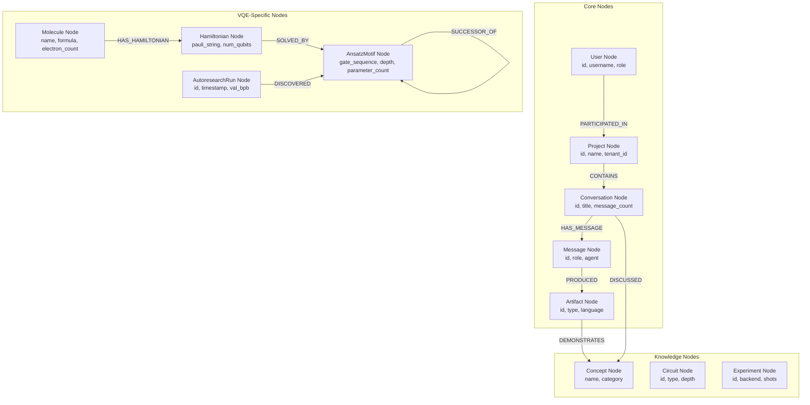
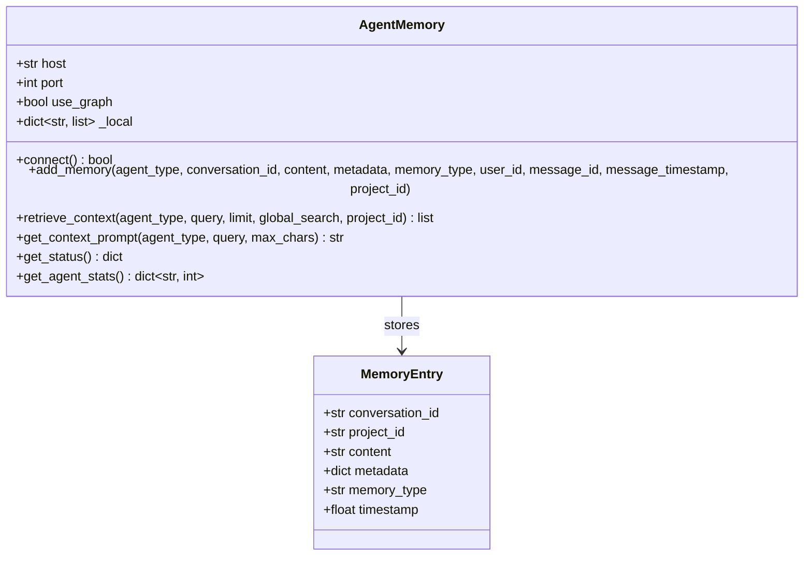
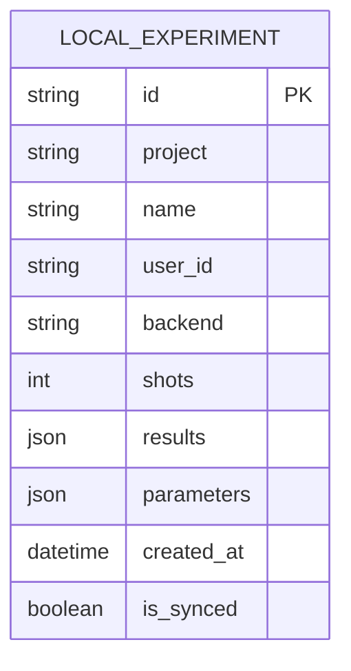
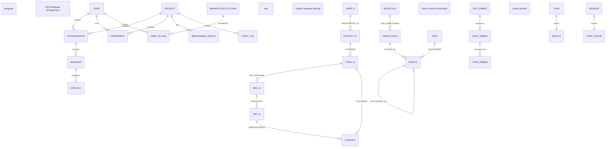

# Milimo Quantum - Data Model Structure

This document provides a comprehensive data model structure for the entire system, including SQL databases, graph databases, vector stores, and API schemas.

**Last Updated:** March 31, 2026

---

## Table of Contents

1. [Overview](#overview)
2. [SQL Database Models (PostgreSQL)](#sql-database-models-postgresql)
3. [Graph Database Models (Neo4j/FalkorDB/Kuzu)](#graph-database-models-neo4jfalkordbkuzu)
4. [Vector Store Models (ChromaDB)](#vector-store-models-chromadb)
5. [Cache Models (Redis)](#cache-models-redis)
6. [API Request/Response Schemas](#api-requestresponse-schemas)
7. [Agent Memory Models](#agent-memory-models)
8. [Platform Configuration Models](#platform-configuration-models)
9. [Local Cache Models (SQLite)](#local-cache-models-sqlite)
10. [Extension Data Models](#extension-data-models)
11. [Entity Relationship Diagrams](#entity-relationship-diagrams)
12. [Data Flow Summary](#data-flow-summary)

---

## Overview

### Database Architecture

| Database | Type | Purpose | ORM/Driver |
|----------|------|---------|------------|
| PostgreSQL | Relational | Primary data store | SQLAlchemy |
| Neo4j | Graph | Knowledge graph, relationships | neo4j-driver |
| FalkorDB | Graph | Agent memory, Redis-graph | redis-graph |
| Kuzu | Graph | Embedded graph (future) | kuzu |
| ChromaDB | Vector | Embeddings, semantic search | chromadb |
| Redis | Cache/Queue | Task queue, caching | redis-py |

### Data Model Categories

```
├── SQL Models (PostgreSQL)
│   ├── User
│   ├── Project
│   ├── Conversation
│   ├── Message
│   ├── Artifact
│   ├── Experiment
│   ├── BenchmarkResult
│   ├── AuditLog
│   ├── MarketplacePlugin
│   └── UserPlugin
│
├── Graph Models (Neo4j)
│   ├── User Node
│   ├── Project Node
│   ├── Conversation Node
│   ├── Message Node
│   ├── Artifact Node
│   ├── Concept Node
│   ├── Experiment Node
│   ├── Circuit Node
│   ├── AnsatzMotif Node
│   └── Molecule Node
│
├── Vector Models (ChromaDB)
│   ├── Conversation Embeddings
│   ├── Code Embeddings
│   └── Document Embeddings
│
└── API Schemas (Pydantic)
    ├── Chat Schemas
    ├── Quantum Schemas
    ├── MQDD Schemas
    └── Workflow Schemas
```

---

## SQL Database Models (PostgreSQL)

### Entity Relationship Diagram

```mermaid
erDiagram
    User ||--o{ Conversation : creates
    User ||--o{ Experiment : runs
    User ||--o{ UserPlugin : installs
    User ||--o{ AuditLog : generates
    
    Project ||--o{ Conversation : contains
    Project ||--o{ Experiment : includes
    Project ||--o{ AuditLog : tracks
    Project ||--o{ BenchmarkResult : has
    
    Conversation ||--o{ Message : contains
    
    Message ||--o{ Artifact : produces
    
    MarketplacePlugin ||--o{ UserPlugin : installed_by

    User {
        string id PK
        string username UK
        string email UK
        string display_name
        string role
        datetime created_at
        datetime last_login
        json settings
    }

    Project {
        string id PK
        string tenant_id IDX
        string name
        text description
        json tags
        json conversation_ids
        datetime created_at
        datetime updated_at
    }

    Conversation {
        string id PK
        string title
        string user_id FK
        string project_id FK
        int message_count
        datetime created_at
        datetime updated_at
    }

    Message {
        string id PK
        string conversation_id FK
        string role
        text content
        string agent
        datetime timestamp
        json metadata
    }

    Artifact {
        string id PK
        string message_id FK
        string type
        string title
        text content
        string language
        json metadata
        datetime created_at
    }

    Experiment {
        string id PK
        string project
        string name
        string user_id FK
        string project_id FK
        string agent
        text circuit_code
        string backend
        int shots
        json results
        json parameters
        json tags
        datetime created_at
        float runtime_ms
        boolean is_synced
    }

    BenchmarkResult {
        string id PK
        string benchmark_name
        int problem_size
        string backend
        int shots
        float preparation_time
        float quantum_exec_time
        float classical_sim_time
        string classification
        json metrics
        string result_summary
        string project_id FK
        datetime timestamp
    }

    AuditLog {
        int id PK
        datetime timestamp
        string user_id
        string action
        string resource_type
        string resource_id
        string project_id FK
        json details
        string ip_address
    }

    MarketplacePlugin {
        string id PK
        string name
        string author
        text description
        string version
        int downloads
        float rating
        json tags
        datetime created_at
    }

    UserPlugin {
        int id PK
        string user_id FK
        string plugin_id FK
        datetime installed_at
    }
```

### Model Definitions

#### User Model

| Field | Type | Constraints | Description |
|-------|------|-------------|-------------|
| id | String(36) | PK, UUID | Primary key |
| username | String(128) | UK, NOT NULL | Unique username |
| email | String(256) | UK | Email address |
| display_name | String(256) | | Display name |
| role | String(32) | DEFAULT 'user' | user/admin/viewer |
| created_at | DateTime | DEFAULT now() | Creation timestamp |
| last_login | DateTime | | Last login time |
| settings | JSON | DEFAULT {} | User preferences |

**Relationships:**
- `conversations`: One-to-Many → Conversation
- `experiments`: One-to-Many → Experiment

---

#### Project Model

| Field | Type | Constraints | Description |
|-------|------|-------------|-------------|
| id | String(36) | PK, UUID | Primary key |
| tenant_id | String(36) | IDX, NOT NULL | Tenant isolation |
| name | String(256) | NOT NULL | Project name |
| description | Text | DEFAULT '' | Project description |
| tags | JSON | DEFAULT [] | Tag list |
| conversation_ids | JSON | DEFAULT [] | Legacy field |
| created_at | DateTime | DEFAULT now() | Creation timestamp |
| updated_at | DateTime | DEFAULT now() | Last update |

**Relationships:**
- `conversations`: One-to-Many → Conversation
- `experiments`: One-to-Many → Experiment
- `audit_logs`: One-to-Many → AuditLog
- `benchmarks`: One-to-Many → BenchmarkResult

---

#### Conversation Model

| Field | Type | Constraints | Description |
|-------|------|-------------|-------------|
| id | String(36) | PK, UUID | Primary key |
| title | String(256) | DEFAULT 'New Conversation' | Conversation title |
| user_id | String(36) | FK → users.id | Owner |
| project_id | String(36) | FK → projects.id | Parent project |
| message_count | Integer | DEFAULT 0 | Message count |
| created_at | DateTime | DEFAULT now() | Creation timestamp |
| updated_at | DateTime | DEFAULT now() | Last update |

**Relationships:**
- `user`: Many-to-One → User
- `project`: Many-to-One → Project
- `messages`: One-to-Many → Message (cascade delete)

---

#### Message Model

| Field | Type | Constraints | Description |
|-------|------|-------------|-------------|
| id | String(36) | PK, UUID | Primary key |
| conversation_id | String(36) | FK → conversations.id | Parent conversation |
| role | String(16) | NOT NULL | user/assistant/system |
| content | Text | NOT NULL | Message content |
| agent | String(32) | | Agent type (code/research/etc) |
| timestamp | DateTime | DEFAULT now() | Message time |
| metadata | JSON | DEFAULT {} | Additional data |

**Relationships:**
- `conversation`: Many-to-One → Conversation
- `artifacts`: One-to-Many → Artifact (cascade delete)

---

#### Artifact Model

| Field | Type | Constraints | Description |
|-------|------|-------------|-------------|
| id | String(36) | PK, UUID | Primary key |
| message_id | String(36) | FK → messages.id | Parent message |
| type | String(32) | NOT NULL | code/circuit/results/notebook |
| title | String(256) | | Artifact title |
| content | Text | | Artifact content |
| language | String(32) | | python/qiskit/openqasm |
| metadata | JSON | DEFAULT {} | Additional data |
| created_at | DateTime | DEFAULT now() | Creation timestamp |

**Relationships:**
- `message`: Many-to-One → Message

---

#### Experiment Model

| Field | Type | Constraints | Description |
|-------|------|-------------|-------------|
| id | String(36) | PK, UUID | Primary key |
| project | String(128) | DEFAULT 'default' | Project name |
| name | String(256) | | Experiment name |
| user_id | String(36) | FK → users.id | Owner |
| project_id | String(36) | FK → projects.id | Parent project |
| agent | String(32) | | Agent that ran experiment |
| circuit_code | Text | | Quantum circuit code |
| backend | String(64) | DEFAULT 'aer_simulator' | Execution backend |
| shots | Integer | DEFAULT 1024 | Number of shots |
| results | JSON | DEFAULT {} | Execution results |
| parameters | JSON | DEFAULT {} | Circuit parameters |
| tags | JSON | DEFAULT [] | Tag list |
| created_at | DateTime | DEFAULT now() | Creation timestamp |
| runtime_ms | Float | | Execution time |
| is_synced | Boolean | DEFAULT False | Sync status |

**Relationships:**
- `user`: Many-to-One → User
- `project_rel`: Many-to-One → Project

---

#### BenchmarkResult Model

| Field | Type | Constraints | Description |
|-------|------|-------------|-------------|
| id | String(36) | PK, UUID | Primary key |
| benchmark_name | String(128) | NOT NULL | Benchmark type |
| problem_size | Integer | NOT NULL | Problem size (qubits) |
| backend | String(64) | NOT NULL | Execution backend |
| shots | Integer | DEFAULT 1024 | Number of shots |
| preparation_time | Float | | Preparation time (s) |
| quantum_exec_time | Float | | Quantum execution time (s) |
| classical_sim_time | Float | | Classical simulation time (s) |
| classification | String(32) | | quantum_advantage/classical_superior/quantum_only |
| metrics | JSON | DEFAULT {} | CLOPS, depth, gates |
| result_summary | String(128) | | Success/Failure |
| project_id | String(36) | FK → projects.id | Parent project |
| timestamp | DateTime | DEFAULT now() | Execution timestamp |

**Relationships:**
- `project`: Many-to-One → Project

---

#### AuditLog Model

| Field | Type | Constraints | Description |
|-------|------|-------------|-------------|
| id | Integer | PK, AUTO | Primary key |
| timestamp | DateTime | DEFAULT now() | Action timestamp |
| user_id | String(36) | | Actor user ID |
| action | String(64) | NOT NULL | create/read/update/delete/execute |
| resource_type | String(32) | NOT NULL | conversation/experiment/circuit |
| resource_id | String(128) | | Resource ID |
| project_id | String(36) | FK → projects.id | Project context |
| details | JSON | DEFAULT {} | Action details |
| ip_address | String(45) | | Client IP |

**Relationships:**
- `project`: Many-to-One → Project

---

#### MarketplacePlugin Model

| Field | Type | Constraints | Description |
|-------|------|-------------|-------------|
| id | String(64) | PK | Plugin ID |
| name | String(256) | NOT NULL | Plugin name |
| author | String(128) | | Author name |
| description | Text | | Plugin description |
| version | String(32) | | Version string |
| downloads | Integer | DEFAULT 0 | Download count |
| rating | Float | DEFAULT 0.0 | Average rating |
| tags | JSON | DEFAULT [] | Tag list |
| created_at | DateTime | DEFAULT now() | Publication date |

---

#### UserPlugin Model

| Field | Type | Constraints | Description |
|-------|------|-------------|-------------|
| id | Integer | PK, AUTO | Primary key |
| user_id | String(36) | FK → users.id | User ID |
| plugin_id | String(64) | FK → marketplace_plugins.id | Plugin ID |
| installed_at | DateTime | DEFAULT now() | Installation date |

---

## Graph Database Models (Neo4j/FalkorDB/Kuzu)

### Neo4j Node Types



### Node Schemas

#### User Node
```cypher
CREATE (u:User {
    id: String,           // UUID
    username: String,     // Unique
    role: String,         // user/admin/viewer
    created_at: DateTime
})
```

#### Conversation Node
```cypher
CREATE (c:Conversation {
    id: String,           // UUID
    title: String,
    message_count: Integer,
    created_at: DateTime,
    updated_at: DateTime
})
```

#### Message Node
```cypher
CREATE (m:Message {
    id: String,           // UUID
    role: String,         // user/assistant/system
    agent: String,        // code/research/chemistry/etc
    timestamp: DateTime,
    content: String       // Optional in graph
})
```

#### Artifact Node
```cypher
CREATE (a:Artifact {
    id: String,           // UUID
    type: String,         // code/circuit/results
    code: String,         // Code content
    language: String,     // python/qiskit/openqasm
    created_at: DateTime
})
```

#### Concept Node
```cypher
CREATE (c:Concept {
    name: String,         // Unique constraint
    category: String,     // quantum/chemistry/finance
    description: String
})
```

#### Circuit Node
```cypher
CREATE (c:Circuit {
    id: String,
    type: String,         // vqe/qaoa/grover/qft
    depth: Integer,
    num_qubits: Integer,
    gate_count: Integer
})
```

#### Experiment Node
```cypher
CREATE (e:Experiment {
    id: String,
    backend: String,
    shots: Integer,
    results: JSON,
    created_at: DateTime
})
```

#### Molecule Node (VQE)
```cypher
CREATE (m:Molecule {
    name: String,         // H2, LiH, BeH2
    formula: String,
    electron_count: Integer,
    ground_state_energy: Float
})
```

#### Hamiltonian Node (VQE)
```cypher
CREATE (h:Hamiltonian {
    id: String,
    pauli_string: String,
    num_qubits: Integer,
    num_terms: Integer,
    basis_set: String     // sto-3g, cc-pvdz
})
```

#### AnsatzMotif Node (VQE)
```cypher
CREATE (a:AnsatzMotif {
    id: String,
    gate_sequence: List[String],
    depth: Integer,
    parameter_count: Integer,
    meyer_wallach_score: Float,
    created_at: DateTime
})
```

#### AutoresearchRun Node
```cypher
CREATE (r:AutoresearchRun {
    id: String,
    timestamp: DateTime,
    val_bpb: Float,
    commit_hash: String,
    status: String        // running/completed/failed
})
```

### Relationship Schemas

#### Core Relationships

| Relationship | From | To | Properties |
|--------------|------|----|----|
| PARTICIPATED_IN | User | Project | timestamp |
| CONTAINS | Project | Conversation | |
| HAS_MESSAGE | Conversation | Message | |
| PRODUCED | Message | Artifact | |
| BELONGS_TO | Artifact | Conversation | |
| DEMONSTRATES | Artifact | Concept | |
| DISCUSSED | Conversation | Concept | |
| USED_AGENT | Conversation | Agent | |

#### VQE Relationships

| Relationship | From | To | Properties |
|--------------|------|----|----|
| HAS_HAMILTONIAN | Molecule | Hamiltonian | |
| SOLVED_BY | Hamiltonian | AnsatzMotif | energy_achieved |
| DISCOVERED | AutoresearchRun | AnsatzMotif | iteration |
| SUCCESSOR_OF | AnsatzMotif | AnsatzMotif | improvement_delta |
| OUTPERFORMS | AnsatzMotif | AnsatzMotif | energy_diff |

### Graph Constraints & Indexes

```cypher
// Unique Constraints
CREATE CONSTRAINT IF NOT EXISTS FOR (c:Concept) REQUIRE c.name IS UNIQUE
CREATE CONSTRAINT IF NOT EXISTS FOR (e:Experiment) REQUIRE e.id IS UNIQUE
CREATE CONSTRAINT IF NOT EXISTS FOR (conv:Conversation) REQUIRE conv.id IS UNIQUE
CREATE CONSTRAINT IF NOT EXISTS FOR (p:Project) REQUIRE p.id IS UNIQUE
CREATE CONSTRAINT IF NOT EXISTS FOR (a:Artifact) REQUIRE a.id IS UNIQUE
CREATE CONSTRAINT IF NOT EXISTS FOR (m:Message) REQUIRE m.id IS UNIQUE
CREATE CONSTRAINT IF NOT EXISTS FOR (mol:Molecule) REQUIRE mol.name IS UNIQUE
CREATE CONSTRAINT IF NOT EXISTS FOR (ans:AnsatzMotif) REQUIRE ans.id IS UNIQUE

// Indexes
CREATE INDEX IF NOT EXISTS FOR (c:Circuit) ON (c.type)
CREATE INDEX IF NOT EXISTS FOR (a:Agent) ON (a.type)
CREATE INDEX IF NOT EXISTS FOR (conv:Conversation) ON (conv.updated_at)
CREATE INDEX IF NOT EXISTS FOR (a:Artifact) ON (a.code)
CREATE INDEX IF NOT EXISTS FOR (ans:AnsatzMotif) ON (ans.meyer_wallach_score)
```

---

## Vector Store Models (ChromaDB)

### Collection: conversations

| Field | Type | Description |
|-------|------|-------------|
| id | String | Conversation UUID |
| embedding | Vector[1536] | OpenAI embedding of conversation |
| document | String | Full conversation text |
| metadata | JSON | {conversation_id, project_id, agent} |

### Collection: code_artifacts

| Field | Type | Description |
|-------|------|-------------|
| id | String | Artifact UUID |
| embedding | Vector[1536] | Code embedding |
| document | String | Code content |
| metadata | JSON | {language, type, conversation_id} |

### Collection: documents

| Field | Type | Description |
|-------|------|-------------|
| id | String | Document UUID |
| embedding | Vector[1536] | Document embedding |
| document | String | Document content |
| metadata | JSON | {source, doc_type, tags} |

### Embedding Operations

```python
# Add conversation embedding
collection.add(
    ids=[conversation_id],
    embeddings=[embedding_vector],
    documents=[conversation_text],
    metadatas=[{"conversation_id": conversation_id, "project_id": project_id}]
)

# Similarity search
results = collection.query(
    query_embeddings=[query_vector],
    n_results=10,
    where={"project_id": project_id}
)
```

---

## Cache Models (Redis)

### Key Patterns

| Key Pattern | Type | TTL | Description |
|-------------|------|-----|-------------|
| `conv:{id}` | Hash | 24h | Conversation cache |
| `msg:{id}` | Hash | 24h | Message cache |
| `user:{id}` | Hash | 1h | User session cache |
| `exp:{id}` | Hash | 1h | Experiment result cache |
| `rate:{ip}` | String | 1m | Rate limit counter |
| `task:{id}` | Hash | 24h | Celery task result |

### Data Structures

#### Conversation Cache
```
conv:{conversation_id}
├── title: String
├── message_count: Integer
├── last_message: String
└── updated_at: ISO8601
```

#### Task Result Cache
```
task:{task_id}
├── status: String        // PENDING/STARTED/SUCCESS/FAILURE
├── result: JSON
├── traceback: String
└── completed_at: ISO8601
```

---

## API Request/Response Schemas

### Chat Schemas

```typescript
// ChatMessage
interface ChatMessage {
  id: string;                    // UUID
  role: 'user' | 'assistant' | 'system';
  content: string;
  agent?: string;                // Agent type
  timestamp: string;             // ISO8601
  artifacts: Artifact[];
}

// Artifact
interface Artifact {
  id: string;
  type: 'code' | 'circuit' | 'results' | 'notebook' | 'report' | 'workflow' | 'circuit_svg' | 'dashboard' | 'analysis' | 'json' | 'svg';
  title: string;
  content: string;
  language?: string;
  metadata: Record<string, any>;
}

// ChatRequest
interface ChatRequest {
  message: string;
  conversation_id?: string;
  project_id?: string;
  agent?: string;
  attached_file_id?: string;
}

// ChatResponse
interface ChatResponse {
  message: ChatMessage;
  conversation_id: string;
}
```

### Quantum Schemas

```typescript
// CircuitRequest
interface CircuitRequest {
  qasm?: string;
  code?: string;
  shots: number;
  backend: string;
}

// ExecutionResult
interface ExecutionResult {
  counts: Record<string, number>;
  circuit_svg: string;
  num_qubits: number;
  depth: number;
  shots: number;
}

// VQERequest
interface VQERequest {
  hamiltonian?: string;
  hamiltonian_custom?: [string, number][];
  ansatz_type?: string;
  ansatz_reps?: number;
  optimizer?: string;
  optimizer_maxiter?: number;
  seed?: number;
}

// VQEResult
interface VQEResult {
  eigenvalue: number;
  reference_energy: number | null;
  optimal_point: number[];
  convergence_trace: {eval: number; energy: number}[];
  circuit_stats: {
    ansatz_type: string;
    depth: number;
    num_qubits: number;
    num_parameters: number;
    entanglement_score: number;
  };
  optimizer: string;
  iterations: number;
  seed: number;
  error?: string;
}
```

### Workflow Schemas

```typescript
// WorkflowRequest
interface WorkflowRequest {
  prompt: string;
  conversation_id?: string;
  basis?: string;
  pdb_content?: string;
}

// TaskStatus
interface TaskStatus {
  task_id: string;
  status: 'PENDING' | 'STARTED' | 'SUCCESS' | 'FAILURE' | 'RETRY';
  result?: any;
  traceback?: string;
}
```

### Platform Schemas

```typescript
// PlatformInfo
interface PlatformInfo {
  os: string;
  arch: string;
  torch_device: string;
  aer_device: string;
  llm_backend: string;
  gpu_available: boolean;
  gpu_name?: string;
}

// SSEEvent
interface SSEEvent {
  event: string; // "token", "artifact", "done", "error"
  data: any;
}
```

---

## Agent Memory Models

### AgentMemory Class (agent_memory.py)

The AgentMemory system provides per-agent episodic memory with local JSON fallback when FalkorDB/Graphiti are unavailable.



#### Memory Entry Structure

| Field | Type | Description |
|-------|------|-------------|
| conversation_id | String | UUID of parent conversation |
| project_id | String | UUID of parent project |
| content | String | Memory content (capped at 2000 chars locally) |
| metadata | JSON | Additional context (circuit type, qubit count, etc.) |
| memory_type | String | interaction, preference, result, insight |
| timestamp | Float | Unix timestamp |

#### Memory Types

| Type | Purpose | Example |
|------|---------|---------|
| interaction | Conversation summary | "User asked about VQE for H2 molecule" |
| preference | User preferences | "User prefers Qiskit over Cirq" |
| result | Experiment outcomes | "VQE converged at -1.137 Ha" |
| insight | Discovered patterns | "Ansatz depth correlates with convergence" |

#### Storage Location

```
~/.milimoquantum/agent_memory/
├── code.json         # Code agent memories
├── research.json     # Research agent memories
├── chemistry.json    # Chemistry agent memories
└── ...               # Per-agent files
```

---

## Platform Configuration Models

### PlatformConfig Dataclass (hal.py)

Platform-specific configuration for quantum execution, detected at startup.

```python
@dataclass
class PlatformConfig:
    os_name: str              # Darwin, Linux, Windows
    arch: str                 # arm64, x86_64
    torch_device: str         # mps, cuda, cpu
    aer_device: str           # GPU, CPU
    llm_backend: str          # mlx, ollama, openai
    gpu_available: bool       # Hardware acceleration
    gpu_name: str | None      # Device name if available
```

#### Platform Detection Results

| Platform | torch_device | aer_device | llm_backend | GPU |
|----------|--------------|------------|-------------|-----|
| macOS ARM64 | mps | CPU | mlx | Apple Silicon (MPS) |
| Linux x86_64 + CUDA | cuda | GPU | ollama | NVIDIA GPU |
| Linux/Windows CPU | cpu | CPU | ollama | None |

#### Simulation Method Selection

```python
def simulation_method(num_qubits: int, is_clifford: bool) -> str:
    if is_clifford:
        return "stabilizer"       # Efficient for Clifford circuits
    if num_qubits <= 24:
        return "statevector"      # Exact, exponential memory
    if num_qubits <= 40:
        return "matrix_product_state"  # Tensor network, polynomial memory
    return "matrix_product_state"      # Default for large circuits
```

---

## Local Cache Models (SQLite)

### LocalCache Database

Offline cache for quantum experiments when PostgreSQL is unavailable.



#### Storage Location

```
~/.milimoquantum/local_cache.db
```

#### Purpose

- Offline experiment tracking
- Sync queue when connectivity restored
- Local experiment history

---

## Extension Data Models

### Autoresearch Extension

```typescript
// RunRequest
interface RunRequest {
  target?: string;
  mode?: 'manual' | 'autonomous';
}

// AutoresearchStatus
interface AutoresearchStatus {
  status: string;
  nemoclaw: boolean;
  vqe_graph: boolean;
  sim_only_mode: boolean;
}

// VQEWorkflowResult
interface VQEWorkflowResult {
  summary: string;
  eigenvalue: number;
  iterations: number;
  meyer_wallach: number;
  ansatz_type: string;
}
```

### MQDD Extension

```typescript
// AdmetProperty
interface AdmetProperty {
  value: string;
  evidence: string;
  score: number;         // 0.0 (good) to 1.0 (bad)
}

// AdmetSchema
interface AdmetSchema {
  logP: AdmetProperty;
  logS: AdmetProperty;
  permeability: AdmetProperty;
  herg: AdmetProperty;
  toxicity: AdmetProperty;
}

// AdmetPredictionResponse
interface AdmetPredictionResponse {
  admet: AdmetSchema;
  painsAlerts: string[];
}

// Interaction
interface Interaction {
  type: 'HydrogenBond' | 'Hydrophobic' | 'PiStacking';
  residue: string;
  ligandAtoms: number[];
  proteinAtoms: number[];
  distance?: number;
}

// MoleculeCandidate
interface MoleculeCandidate {
  name: string;
  smiles: string;
  bindingEnergy?: number;
  saScore?: number;
  admet?: AdmetSchema;
  painsAlerts?: string[];
  interactions?: Interaction[];
}

// MqddResultData
interface MqddResultData {
  summary: string;
  pdbId?: string;
  molecules: MoleculeCandidate[];
  literature: LiteratureReference[];
  experimentalPlan: string[];
  retrosynthesisPlan: string[];
  knowledgeGraphUpdate?: KnowledgeGraphUpdate;
  proactiveSuggestions: string[];
  failureAnalysisReport?: string;
}

// KnowledgeGraphUpdate
interface KnowledgeGraphUpdate {
  nodes: GraphNode[];
  edges: GraphEdge[];
}
```

---

## Entity Relationship Diagrams

### Complete System ERD



---

## Data Flow Summary

### Write Path

1. **User Action** → API Request
2. **API** → Validate with Pydantic schema
3. **SQL DB** → Insert/Update with SQLAlchemy
4. **Graph DB** → Index nodes/relationships
5. **Vector DB** → Store embeddings (async)
6. **Cache** → Update relevant caches
7. **Audit Log** → Record action

### Read Path

1. **API Request** → Check cache first
2. **Cache Hit** → Return cached data
3. **Cache Miss** → Query SQL DB
4. **Graph Query** → Fetch relationships
5. **Vector Search** → Semantic search if needed
6. **Response** → Combine and return

### Query Examples

#### Get Conversation with Messages
```sql
-- SQL Query
SELECT c.*, 
       json_agg(json_build_object(
           'id', m.id,
           'role', m.role,
           'content', m.content,
           'agent', m.agent,
           'artifacts', (
               SELECT json_agg(json_build_object(
                   'id', a.id,
                   'type', a.type,
                   'title', a.title
               )) FROM artifacts a WHERE a.message_id = m.id
           )
       )) as messages
FROM conversations c
LEFT JOIN messages m ON m.conversation_id = c.id
WHERE c.id = :conversation_id
GROUP BY c.id;
```

#### Get Related Concepts (Neo4j)
```cypher
MATCH (conv:Conversation {id: $conv_id})-[:DISCUSSED]->(c:Concept)
OPTIONAL MATCH (c)<-[:DEMONSTRATES]-(a:Artifact)
RETURN c.name as concept, 
       count(a) as artifact_count,
       collect(a.id) as artifacts
ORDER BY artifact_count DESC
LIMIT 10
```

#### Semantic Search (ChromaDB)
```python
results = collection.query(
    query_embeddings=[query_embedding],
    n_results=5,
    where={"project_id": project_id},
    include=["documents", "metadatas", "distances"]
)
```

---

## Index Recommendations

### PostgreSQL Indexes

```sql
-- Foreign keys are auto-indexed
CREATE INDEX idx_conversation_project ON conversations(project_id);
CREATE INDEX idx_message_conversation ON messages(conversation_id);
CREATE INDEX idx_artifact_message ON artifacts(message_id);
CREATE INDEX idx_experiment_project ON experiments(project_id);
CREATE INDEX idx_benchmark_project ON benchmark_results(project_id);

-- Query optimization
CREATE INDEX idx_conversation_updated ON conversations(updated_at DESC);
CREATE INDEX idx_message_timestamp ON messages(timestamp DESC);
CREATE INDEX idx_experiment_backend ON experiments(backend);
```

### Neo4j Indexes

```cypher
-- Already defined in ensure_schema()
-- Additional recommendation for text search:
CREATE INDEX IF NOT EXISTS FOR (c:Concept) ON (c.name);
CREATE INDEX IF NOT EXISTS FOR (c:Circuit) ON (c.type);
```

---

*Document Generated: March 31, 2026*
*Total Models: 10 SQL + 11 Graph + 3 Vector + 9 API categories + 3 Platform/Memory models*
*Total Relationships: 15+*
*Last Updated: March 31, 2026*

## Summary of Models

| Category | Count | Examples |
|----------|-------|----------|
| SQL Models | 10 | User, Project, Conversation, Message, Artifact, Experiment, BenchmarkResult, AuditLog, MarketplacePlugin, UserPlugin |
| Graph Nodes | 11 | User, Project, Conversation, Message, Artifact, Concept, Circuit, Experiment, Molecule, Hamiltonian, AnsatzMotif |
| Vector Collections | 3 | conversations, code_artifacts, documents |
| API Schemas | 15+ | ChatMessage, Artifact, CircuitRequest, ExecutionResult, VQERequest, VQEResult, PlatformInfo, SSEEvent, WorkflowRequest, TaskStatus, AdmetSchema, MoleculeCandidate |
| Agent Memory | 1 | AgentMemory (with MemoryEntry) |
| Platform Config | 1 | PlatformConfig |
| Local Cache | 1 | LocalCache (SQLite) |
